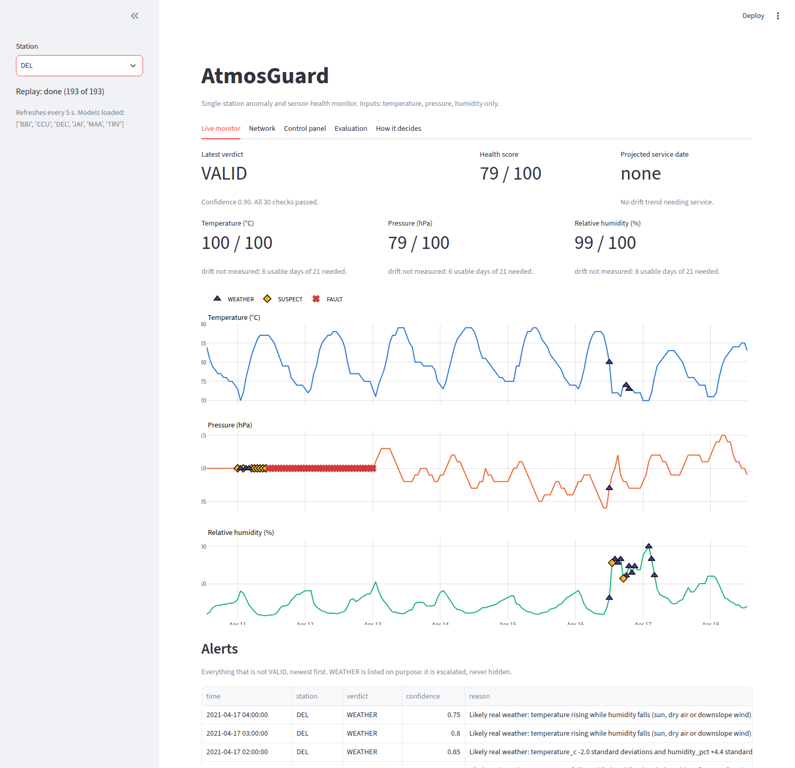

# AtmosGuard

**Is this the sensor, or is this the sky?** An anomaly and sensor-health system for an Automatic Weather Station (AWS), built
for SIH 2026 problem statement 26073. It uses **only temperature, pressure and relative humidity**, one station at a time,
with **no neighbours**.

A broken barometer and a cyclone look the same on a chart. AtmosGuard answers per reading with one of four verdicts,
`VALID | WEATHER | SUSPECT | FAULT`: real weather is **escalated as an alert, never deleted as noise**, and every verdict comes
with a plain-English reason, a health score and a service-date estimate. The raw value is never overwritten.



*The real dashboard on the real pipeline: at Delhi a frozen barometer is armed on top of a real thunderstorm outflow. The red crosses are the fault; the purple triangles are the real weather, escalated and not deleted.*

## What makes this submission different (and what it does not claim)
- **We do not claim a new algorithm.** Physics checks, persistence tests, CUSUM, Isolation Forest and SHAP are standard. See
  [`docs/NOVELTY_AND_PRIOR_ART.md`](docs/NOVELTY_AND_PRIOR_ART.md) for what is standard, what we adapted (and from whom), and what is ours.
- **We evaluate on real weather.** 26 Indian airport stations, 2016-2024 (NOAA ISD; 14 for development and the first holdouts, 12 more sealed for a fresh test), real cyclones (Vardah, Fani, Amphan, Tauktae,
  Michaung, Remal, Biparjoy...), heat waves, cold waves and thunderstorm outflows, chosen by rule on the data. The false-alarm rate
  **on real extreme weather is reported separately** from the injected-fault score.
- **The holdout was sealed in time and in space and run once**, with the protocol committed first. Whatever it gave is below.
- **The holdout found failures, and we tested the fix on stations nobody had looked at.** The post-mortem proposed two remedies. Before testing
  them we registered a decision rule (Amendment 2) and sealed twelve more stations. By that rule the ceiling-aware frozen rule is **adopted** and
  the learned step cap is **rejected** (it cost detection of wrong clocks). The tables are in the results below and in `results/REPORT.md`.
- **Real data broke our first version, and we kept the record**: on real airport METAR (whole degrees, whole hPa) the fixed-limit
  pipeline alarmed on 63 % of clean samples (the results row "without station-learned limits"), a real pressure plateau inside a
  cyclone read as a frozen barometer, and real thunderstorm outflows were called faults. What we changed and why is in the tuning log in
  [`config/protocol.md`](config/protocol.md).
- **We say what we cannot do:** [`docs/WHAT_WE_DO_NOT_CLAIM.md`](docs/WHAT_WE_DO_NOT_CLAIM.md) and
  [`docs/FAILURE_MODES.md`](docs/FAILURE_MODES.md).

## Results at a glance
<!-- RESULTS:START -->
| | DEV (tuned here) | Holdout, same stations, later years | Holdout, eight unseen stations | Fresh, twelve more unseen stations (sealed before the remedies were tested) | Fresh 2, twelve more: five Indian airports and seven Australian AWS at 0.1 resolution |
|---|---|---|---|---|---|
| **False alarms on clean real data** | 1.9% (1.8-2.0) of 98340 samples got FAULT or SUSPECT; 0.0% (0.0-0.0) got FAULT | 2.5% (2.4-2.6) of 147078 samples got FAULT or SUSPECT; 0.0% (0.0-0.0) got FAULT | 2.9% (2.8-3.0) of 237411 samples got FAULT or SUSPECT; 0.0% (0.0-0.1) got FAULT | 2.5% (2.5-2.6) of 364440 samples got FAULT or SUSPECT; 0.1% (0.1-0.1) got FAULT | 9.3% (9.2-9.3) of 453323 samples got FAULT or SUSPECT; 0.0% (0.0-0.0) got FAULT |
| **Real cyclones, heat, cold, fronts (nothing injected)** | FAULT on 0.0% (0.0-0.1) of 3503 samples (0 of 30 windows); WEATHER on 10.8%, SUSPECT on 9.0% | FAULT on 0.0% (0.0-0.1) of 4374 samples (0 of 38 windows); WEATHER on 11.8%, SUSPECT on 8.2% | FAULT on 0.3% (0.2-0.4) of 9074 samples (3 of 98 windows); WEATHER on 15.7%, SUSPECT on 8.6% | FAULT on 0.1% (0.1-0.2) of 11782 samples (3 of 139 windows); WEATHER on 10.3%, SUSPECT on 6.8% | FAULT on 0.0% (0.0-0.1) of 14732 samples (4 of 134 windows); WEATHER on 4.1%, SUSPECT on 14.1% |
| **Injected faults detected (injected, not real)** | frozen 100%; spike 98%; level shift 97%; noise burst 78%; dropout 99%; clock 3 h out 97% | frozen 100%; spike 96%; level shift 98%; noise burst 79%; dropout 100%; clock 3 h out 97% | frozen 100%; spike 90%; level shift 89%; noise burst 67%; dropout 98%; clock 3 h out 84% | frozen 99%; spike 91%; level shift 80%; noise burst 57%; dropout 98%; clock 3 h out 85% | frozen 100%; spike 89%; level shift 91%; noise burst 83%; dropout 93%; clock 3 h out 90% |
| **Agreement with NOAA quality flags** | escalated (FAULT, SUSPECT or WEATHER) on 66.9% of 236 NOAA-flagged values (FAULT or SUSPECT alone: 22.9%); escalated on 4.7% of the 101736 values NOAA left alone | escalated (FAULT, SUSPECT or WEATHER) on 61.5% of 265 NOAA-flagged values (FAULT or SUSPECT alone: 18.5%); escalated on 5.7% of the 151336 values NOAA left alone | escalated (FAULT, SUSPECT or WEATHER) on 67.6% of 559 NOAA-flagged values (FAULT or SUSPECT alone: 40.8%); escalated on 6.9% of the 246257 values NOAA left alone | escalated (FAULT, SUSPECT or WEATHER) on 71.1% of 974 NOAA-flagged values (FAULT or SUSPECT alone: 54.9%); escalated on 5.7% of the 375993 values NOAA left alone | escalated (FAULT, SUSPECT or WEATHER) on 67.8% of 708 NOAA-flagged values (FAULT or SUSPECT alone: 43.1%); escalated on 11.5% of the 467945 values NOAA left alone |
| **Slow drift (one station, no reference)** | false drift claims on 1.1% of 3859 station-days; an injected ramp reaching 8x the service limit was found in 56% of trials | false drift claims on 1.1% of 5797 station-days; an injected ramp reaching 8x the service limit was found in 50% of trials | false drift claims on 0.6% of 12495 station-days; an injected ramp reaching 8x the service limit was found in 56% of trials | false drift claims on 0.9% of 18493 station-days; an injected ramp reaching 8x the service limit was found in 62% of trials | false drift claims on 0.4% of 17919 station-days; an injected ramp reaching 8x the service limit was found in 50% of trials |

Real NOAA records: 26 Indian airport stations in DEV, holdout and Fresh, then Fresh 2 with five more Indian airports and seven Australian automatic weather stations. Full tables, baselines and ablation: [`results/REPORT.md`](results/REPORT.md). Protocol written and committed before the holdout was read: [`config/protocol.md`](config/protocol.md).
<!-- RESULTS:END -->

### A brand-new station, on its first day
<!-- COLDSTART:START -->
| days of own history | with a starter: clean false alarms | with a starter: FAULT on real extreme weather | with a starter: injected faults detected | own data only: clean false alarms | own data only: FAULT on real extreme weather | own data only: injected faults detected |
|---|---|---|---|---|---|---|
| 0 | 6.09% | 0.0% | 86.4% | 62.72% | 28.6% | 79.6% |
| 30 | 5.79% | 0.0% | 85.8% | 16.53% | 4.97% | 84.0% |
| 90 | 7.34% | 0.0% | 95.7% | 12.83% | 0.03% | 92.0% |
| 365 | 4.17% | 0.0% | 97.5% | 5.3% | 0.0% | 96.9% |
| 1460 | 1.88% | 0.0% | 96.3% | 1.88% | 0.0% | 96.3% |

Leave-one-station-out on the six DEV stations, judged on each station's DEV years (2020-2021), which it never trained on. The starter is a frozen normality table and frozen limits from the nearest other station, blended out as the station's own history grows; no live data of another station is used. Injected faults here are frozen, spike and level shift only. Details: [`results/REPORT.md`](results/REPORT.md). (42 jobs, 8.7 minutes on 4 workers.)
<!-- COLDSTART:END -->

Data caveats that apply to every number: airport METAR/SYNOP records (not IMD AWS records); humidity is derived from the dew point;
no labelled real faults exist, so detection is measured on injected faults; NOAA's flags are another automated system, not ground truth.

## Known limits (read before relying on any number)
- **Real extreme weather is not always safe.** With the pipeline as frozen for each set, real extreme-weather windows that contain a `FAULT`: 3 of 98 on the eight unseen stations of the first holdout
  (Visakhapatnam saturation twice, Bhuj temperature across a 6-hour gap), 3 of 139 on the twelve fresh stations (Ranchi saturation, Coimbatore humidity +47 % in two hours, Jodhpur temperature across a
  gap) and 4 of 134 on the twelve fresh-2 stations (a fast humidity drop or afternoon warming in a desert or alpine air mass at Giles and Thredbo). Two remedies were adopted by rules registered before
  each test: the ceiling-aware frozen rule (fresh) and the expected-change-aware step rule (fresh-2, 4 windows to 1). The one that remains is Thredbo, October 2023, humidity -48.9 % in two hours.
  Causes and remedies: [`docs/HOLDOUT_POSTMORTEM.md`](docs/HOLDOUT_POSTMORTEM.md), Amendments 2 and 3 in [`config/protocol.md`](config/protocol.md).
- **A station whose training record is irregular can flood with false alarms.** On fresh-2, false alarms on clean data are 3.2 % on the five Indian airports and 13.6 % on the seven Australian AWS, and
  almost all of the excess sits at four AWS (Mount Crawford 33 %, Cape Wessel 26 %, Lady Elliot Island 21 %, Willis Island 8 %) whose 2016-2019 records had 16 reports a day with alternating 1 h and 2 h
  gaps and were hourly all day from 2020: no noise limit could be learned, and the fixed floor alarms on 0.1-resolution data. The pipeline now says so on every reading (an informational `limits` notice)
  and a refit on the current cadence is the remedy (`python refit.py your.csv --station ID --from DATE`): fitted on the hourly years only, the seven Australian AWS drop from 13.6 % to 2.6 % false alarms ([`refit_diagnostic.py`](refit_diagnostic.py), post-hoc, not sealed evidence, different judged years).
- **Noise bursts are the weakest injected-fault class**, and a wrong clock takes on the order of a day to notice. A stuck sensor
  takes hours by design (it has to stay stuck longer than real weather can). On the unseen stations (all three sets) detection is lower than on DEV
  for spikes, level shifts, noise bursts and wrong clocks (table above). A remedy aimed at level shifts (a sustained one-channel offset) was tested on fresh-2 and rejected: +1 point against the +5 registered.
- **Most detections of spikes, level shifts, noise bursts and wrong clocks are `SUSPECT` (review), not `FAULT`.** `FAULT` is for frozen sensors, dropouts,
  impossible values and a lone jumping channel; the table "How AtmosGuard names what it detects" in [`results/REPORT.md`](results/REPORT.md) gives the share named
  `FAULT` for every type. "Detected" in the tables means an alarm of either kind. This is a design choice: promoting a persistent `SUSPECT` to `FAULT` would put real storms in the `FAULT` column.
- **Simpler detectors beat us on some fault types.** A Mahalanobis-distance-only baseline detects spikes at least as well as the full
  pipeline (and level shifts on DEV and the fresh stations) with fewer false alarms, and is blind to frozen sensors, dropouts and wrong
  clocks. The textbook range + step + persistence rules detect wrong clocks better than we do on unseen stations, at 5 to 8 % false alarms and a FAULT in nearly every real extreme-weather window.
  No single simpler system covers all six types without paying for it elsewhere; the layers buy coverage. See "No single simpler system" in [`results/REPORT.md`](results/REPORT.md).
- **Small faults are missed.** Detection climbs steeply with the size of a spike, level shift or noise burst: below about half of the size we
  inject (a level shift of 5 C, 5 hPa or 20 % RH), most are missed, and at the full size most are found. The curve, against two simpler systems, is
  [`docs/figures/fig_detectability.png`](docs/figures/fig_detectability.png) (DEV stations, injected faults).
- **Constant offsets and slow drift are invisible from one station, and visible with neighbours.** The single-station drift monitor sees a ramp of several times the service limit. The optional peer layer
  ([`docs/PEER_LAYER.md`](docs/PEER_LAYER.md)) compares a station with three or more neighbours within 250 km: on two disjoint clusters of Australian AWS it finds a 2 hPa offset 91-96 % of the time within
  21 days where the station alone finds 0-4 %. On 31 Indian airport stations with the radius widened to 600 km (the spacing India has) it finds a 2 hPa offset 91 % of the time against 21 % alone, but gains nothing on humidity and has more false alarms (2-4 % of days). It needs neighbours, misses offsets of half a unit, and was measured on injected faults.
- **No IMD record, and no sub-hourly record, has been tested.** IMD AWS records are not public and the hosts that might serve one are blocked where this was built ([`docs/IMD_DATA_REQUEST.md`](docs/IMD_DATA_REQUEST.md)
  is a draft request). Fresh-2 adds seven real Australian Bureau of Meteorology automatic weather stations at 0.1 C and 0.1 hPa (hourly), which is real AWS data at fine resolution but not IMD and not 1-15 minute cadence.
  [`docs/USE_YOUR_DATA.md`](docs/USE_YOUR_DATA.md) gives the one command that produces the same numbers for a real AWS record.
- **The firmware runs on the laptop, not on the chip.** `node.ino` executes unmodified against a simulator of the Arduino-ESP32 pieces (clock, sensor, Wi-Fi, HTTP) and what it sends is accepted by the real API;
  the L0 header is compared with the Python. Compilation with the real ESP32 toolchain and a run on hardware are not done ([`docs/HARDWARE_TEST_LOG.md`](docs/HARDWARE_TEST_LOG.md) is the checklist).
- **Docker was built and run once** (image, compose, health check, a cyclone replay); it is not part of CI.

## Run it (one minute, no internet, no downloads)
```bash
python -m venv .venv && source .venv/bin/activate      # Windows: .venv\Scripts\activate
pip install -r requirements.txt
uvicorn api:app --port 8000 &                           # loads the six trained stations from models/
streamlit run dashboard.py                              # http://localhost:8501
```
The dashboard has a **Live monitor**, a **Network** view (every station, most urgent first), the **Control panel**, the **Evaluation** tables and **How it decides**. In the **Control panel**: replay a real cyclone (`data/demo/`), **break the sensor on demand** (frozen, spike,
level shift, drift, noise, dropout), and watch the verdict, the reason and the health score react, or **bring your own CSV** and watch it judged (a new station learns from the first half of the file). **No server?**
Open [`docs/demo/index.html`](docs/demo/index.html): a self-contained replay of six real events with the pipeline's actual verdicts.

`make api`, `make dashboard`, `make replay`, `make test` do the same in one word each. Also: `python -m pytest -q` (470 tests) - `docker compose up --build` - `python simnode.py --station BBI --minutes 120` (fake node) -
full reproduction commands in [`docs/REPRODUCE.md`](docs/REPRODUCE.md).

## How it works


```
ESP32 + BME280 (L0 on device)  -+
Replay of real records + live   -+-> POST /ingest -> L0 physics -> L1 health -> L2 normality -> L3 Isolation Forest + Mahalanobis
fault injection                                       -> timing (clock, co-jump) -> fusion -> VALID | WEATHER | SUSPECT | FAULT
                                                          + confidence + reason + health score + drift monitor + ticket + estimate
                                                          -> SQLite (raw, verdict, checks side by side) -> dashboard
```
| Layer | What it checks |
|---|---|
| L0 physics | ranges, dew point <= temperature, wet-bulb (soft flag only). Closed-form; also runs on the ESP32 |
| L1 health | frozen (limit learned per station, two tiers, soft when the air is saturated), step, spike, noise (limit learned per station), gaps (a notice), CUSUM |
| L2 normality | is this normal for THIS station, in THIS month, at THIS hour? |
| L3 | Isolation Forest, and a Mahalanobis distance of (departure from normal, rate of change) that names the channel that drove it |
| Timing | T1 clock phase (a 3-hour clock error), T2 same-instant jump on several channels |
| Fusion | impossible/frozen/missing -> FAULT; one channel jumps while the others are actually quiet -> FAULT; several channels move or depart together -> WEATHER; unusual but ambiguous -> SUSPECT |
| Health | score, drift monitor (daily means, autocorrelation-aware test, isolated-trend rule, persistence), ticket, projected service date, and the smallest drift it can see |
| Estimate | a value for a missing or faulty reading, with an uncertainty band, stored beside the raw value |

Every layer has a config switch, so the ablation needs no code edits and the system still runs with any layer off.
More: [`docs/ARCHITECTURE.md`](docs/ARCHITECTURE.md).

## Evidence and documents
| | |
|---|---|
| Results (all tables: DEV, both holdouts, the fresh stations, cold start, speed) | [`results/REPORT.md`](results/REPORT.md), raw JSON in `results/` |
| Protocol, split, tuning log | [`config/protocol.md`](config/protocol.md) |
| Technical report | [`docs/TECHNICAL_REPORT.md`](docs/TECHNICAL_REPORT.md) |
| Novelty and prior art | [`docs/NOVELTY_AND_PRIOR_ART.md`](docs/NOVELTY_AND_PRIOR_ART.md) |
| What we do not claim / failure modes | [`docs/WHAT_WE_DO_NOT_CLAIM.md`](docs/WHAT_WE_DO_NOT_CLAIM.md), [`docs/FAILURE_MODES.md`](docs/FAILURE_MODES.md) |
| Use cases (cyclones, NWP, aviation, maintenance, sparse networks) | [`docs/USE_CASES.md`](docs/USE_CASES.md) |
| Data provenance and limits | [`docs/DATA.md`](docs/DATA.md) |
| Run the evaluation on your own (real AWS) record | [`docs/USE_YOUR_DATA.md`](docs/USE_YOUR_DATA.md) |
| What the holdout found, and what we did not do about it | [`docs/HOLDOUT_POSTMORTEM.md`](docs/HOLDOUT_POSTMORTEM.md) |
| Hardware node, BOM, energy (estimate, not measurement); the one-hour checklist for the board | [`docs/HARDWARE.md`](docs/HARDWARE.md), [`docs/HARDWARE_TEST_LOG.md`](docs/HARDWARE_TEST_LOG.md) |
| Optional peer layer: constant offsets and slow drift seen with neighbours (two Australian AWS clusters) | [`docs/PEER_LAYER.md`](docs/PEER_LAYER.md) |
| A message to request a real IMD AWS record, and what to run when it arrives | [`docs/IMD_DATA_REQUEST.md`](docs/IMD_DATA_REQUEST.md) |
| Demo script and contingencies | [`docs/DEMO_RUNBOOK.md`](docs/DEMO_RUNBOOK.md) |
| Likely judge questions and honest answers | [`docs/JUDGE_QA.md`](docs/JUDGE_QA.md) |
| **Start here if you are making the deck: everything that was done, what to submit, how** | [`docs/HANDOFF_FOR_PPT.md`](docs/HANDOFF_FOR_PPT.md) |
| Submission playbook (criteria -> artifacts, what is left for the team) | [`docs/SIH_SUBMISSION_PLAYBOOK.md`](docs/SIH_SUBMISSION_PLAYBOOK.md) |
| One-page summary for a handout or upload (numbers computed from the results) | [`docs/AtmosGuard_one_page.pdf`](docs/AtmosGuard_one_page.pdf) |
| Portal text, pitch scripts and a slide-by-slide plan (content only) | [`docs/SUBMISSION_TEXT.md`](docs/SUBMISSION_TEXT.md), [`docs/SLIDE_PLAN.md`](docs/SLIDE_PLAN.md) |
| Research: humidity response time (tau_RH), where it works and where it does not | [`research/tau_rh.py`](research/tau_rh.py) |

## Repository map
`atmos/` the pipeline - `api.py` FastAPI - `dashboard.py` Streamlit - `evaluate_real.py` the real-data evaluation -
`evaluate_coldstart.py` new-station study - `evaluate_csv.py` the same evaluation on your CSV - `loadtest.py` scale test - `data_tools/` NOAA download, split, event rules -
`make_report.py` (technical report from the results), `make_onepager.py`, `make_diagrams.py` and `capture_dashboard.py` (handout and slide assets), `compare_runs.py` (did a rerun reproduce?) - `firmware/node/` ESP32 sketch and the portable L0 header - `train.py` per-station models - `make_summary.py`,
`make_figures.py`, `make_offline_demo.py` - `data/real/dev`, `data/holdout/real`, `data/fresh/real` and `data/fresh2/real` (each sealed until its single run), `evaluate_peers.py` and `atmos/peers.py` (the optional neighbour layer), `data/demo` -
`models/` trained station artifacts - `tests/` 470 tests.

## Standard practice (not our invention)
Physics checks, persistence (frozen-value) checks including station-learned thresholds (HadISD), CUSUM, Theil-Sen and
Mann-Kendall trend tests, Isolation Forest, Mahalanobis distance, SHAP, weather-versus-fault discrimination (ECMWF, Oklahoma
Mesonet), health scores and maintenance tickets, and the neighbour comparison of the optional peer layer (spatial regression and buddy checks: Hubbard et al. 2005, Durre et al. 2010, MADIS).

## What is ours
- The evidence standard: 26 real stations, a holdout sealed in time and space, twelve fresh stations tested against a rule registered first, false alarms on real cyclones reported separately,
  baselines and an ablation on the same data, agreement with NOAA's flags, and the failures kept on record.
- A single-station, neighbour-free integration that copes with the rounded values real stations report.
- `WEATHER` as a verdict of its own (escalate, never suppress), by movement **and** by level.
- A drift monitor with an isolated-trend rule and a stated detectability floor.
- Edge parity: the ESP32's L0 code is compiled and tested against the Python on a laptop.
- Live fault injection for the demo, and a measured boundary for the humidity response-time idea.

## What we do not claim
Any new technique. Real-fault accuracy (only injected faults exist to measure). Small drifts or constant offsets from a single
station with no reference. Long-term drift validation. Calibrated confidence (it is agreement between checks). That the firmware
has run on hardware or that any energy figure is measured. That humidity response time works in the field. Full list:
[`docs/WHAT_WE_DO_NOT_CLAIM.md`](docs/WHAT_WE_DO_NOT_CLAIM.md).

## Licence
Code and documents: [Apache License 2.0](LICENSE) (permissive, with an explicit patent grant; keep the copyright and NOTICE lines). The weather data are derived from NOAA's Integrated Surface Database and keep the terms described in [`NOTICE`](NOTICE).

## Input rules
CSV columns `timestamp, temperature_c, pressure_hpa, humidity_pct` (+ optional `station_id`); an empty cell is a missing value.
Timestamps are UTC (a timestamp with a zone is converted). NaN or infinite is stored as missing and judged as a dropout. Absurd
finite numbers are stored as they are and get FAULT. If the checks ever fail on a reading it is stored raw and marked SUSPECT with a
`pipeline_error` check. Put a station in `config/stations.yaml` with its `cadence_minutes`; without it the cadence is guessed.

## Out of scope
tau_RH in the live pipeline (research only). The pressure-tide barometer check. A hard "wet-bulb 35 C is impossible" rule (it is a soft flag).
Spatial and neighbour-station checks (by design).
