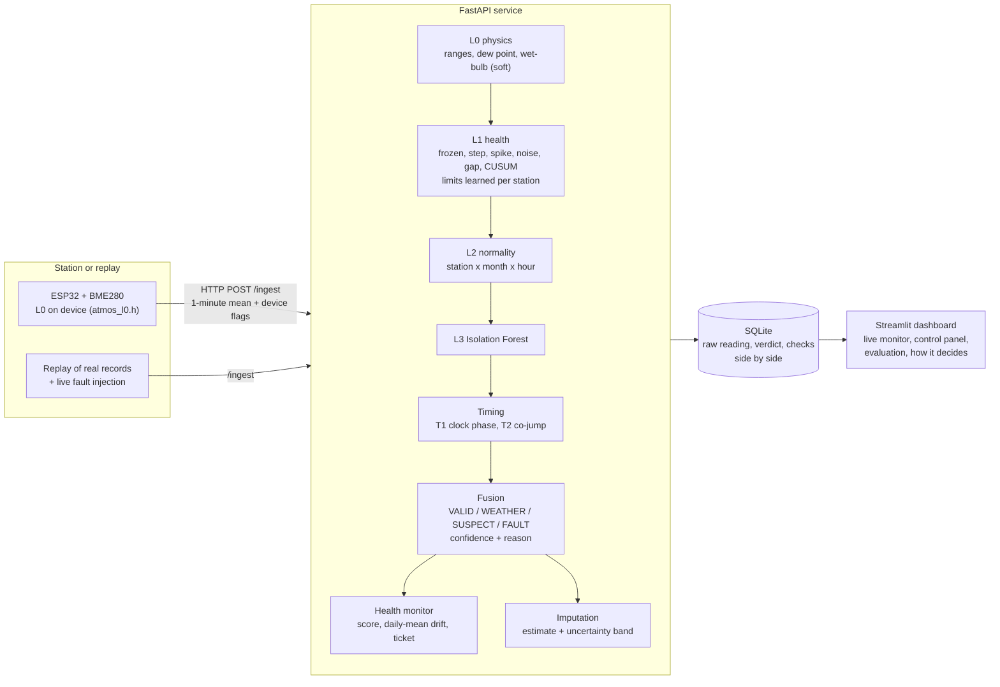

# Architecture

One station, no neighbours. Readings pass through layers that get more expensive; a fusion step chooses one of four
verdicts; the output is a verdict, a reason in plain English, a health score, a drift-based service date, and an
optional estimate for a missing or faulty value.

## The four verdicts and the fusion rule

| Verdict | Meaning | Rule (first match wins) |
|---|---|---|
| `FAULT` | the sensor or the link is broken | a hard flag from range, dew point, frozen (at twice the learned limit) or dropout; **or** one channel jumps while the other two stay quiet |
| `WEATHER` | real weather, **escalated** as an alert, never suppressed | only soft flags, and two or more channels move together, smoothly, in a known pattern (falling pressure + rising humidity; cooling + moistening; warming + drying; rising pressure + drying) |
| `SUSPECT` | unusual, evidence mixed; the reading is kept and marked | a soft flag (normality, drift, Isolation Forest, timing, frozen just past the learned limit) that no rule above explains |
| `VALID` | nothing objects | otherwise |

Evidence that **does not** change the verdict but is shown on the reading as a *notice*: a communication gap.

Confidence is agreement between checks, not a probability. Raw values are never overwritten: the verdict, the checks and an
optional imputed value are stored beside the raw reading.

## Why each design decision is what it is

| Decision | Reason |
|---|---|
| Single station, no neighbours | the places India most needs this (Ladakh, the Thar, the Andamans) have no neighbour within hundreds of km |
| L0 is arithmetic and runs on the device | obviously impossible data never uses bandwidth; the same C++ is tested against Python |
| Limits are learned per station | a station that reports whole degrees repeats values in normal weather; fixed limits alarmed on two thirds of clean real data |
| Frozen is graded (soft, then hard at 2x) | a pressure plateau inside a cyclone must not become a FAULT |
| WEATHER is a verdict | quality control and severe-weather alerting come out of one engine |
| Mixed evidence is SUSPECT, not FAULT | deleting a real extreme is far worse than flagging a fault for review |
| Drift is judged on daily means with an isolated-trend rule and persistence | hourly residuals are autocorrelated (98 % false drift claims); a monsoon onset trends several channels at once, a sick sensor trends one |
| Every layer has a config switch | the ablation needs no code edits; if the ML layer is removed the system still runs |
| Gaps are notices | the values after a gap are fine |

## Modules

| File | Role |
|---|---|
| `atmos/physics.py` | L0 checks |
| `atmos/health.py` | L1 checks (frozen two-tier, step, spike, noise, gap, timestamp, CUSUM) |
| `atmos/limits.py` | station-learned frozen and noise limits, resolution detection |
| `atmos/normality.py` | L2 table, smooth expected value |
| `atmos/mlmodel.py` | L3 Isolation Forest and the Mahalanobis model. A live reading is scored by a vectorised routine whose numbers are bit-identical to scikit-learn's (`tests/test_fast_forest.py`), about 25 times faster per reading; whole series in the evaluation still go through scikit-learn in one batch |
| `atmos/timing.py` | T1 clock phase, T2 co-jump |
| `atmos/fusion.py` | verdict rules, `Pipeline` (state per station) |
| `atmos/healthscore.py` | score, `DriftTracker`, drift test, ticket |
| `atmos/impute.py` | estimate + band for a missing or faulty value |
| `atmos/livefault.py` | live fault injection behind `POST /inject` |
| `atmos/injector.py` | offline fault injection with a ground-truth log |
| `api.py` | FastAPI: `/ingest /latest /alerts /health /fleet /explain /replay /inject /datasets /metrics /status` (`/fleet` lists every station with its newest verdict, health score and ticket, for the dashboard's Network tab; each station is still judged on its own) |
| `dashboard.py` | Streamlit |
| `evaluate_real.py` | the real-data evaluation (DEV / HOLDOUT) |
| `data_tools/` | NOAA ISD download, parse, dataset split, event windows |
| `firmware/node/` | ESP32 sketch and the portable L0 header |
| `research/tau_rh.py` | humidity response-time research tools |

## API

| Endpoint | Purpose |
|---|---|
| `POST /ingest` | one reading in, full verdict out |
| `GET /latest`, `GET /alerts`, `GET /health` | readings with verdicts, the alert feed, health score + ticket + drift floor |
| `POST /replay`, `GET /replay`, `DELETE /replay` | play a CSV from `data/` (never `data/holdout/`) |
| `POST /inject`, `GET /inject`, `DELETE /inject` | arm, list, clear live faults |
| `GET /datasets` | replayable CSV files |
| `GET /metrics` | the committed evaluation summary |
| `GET /status` | layers, models loaded, verdict counts, armed faults |

OpenAPI docs are served at `/docs` when the API is running.
