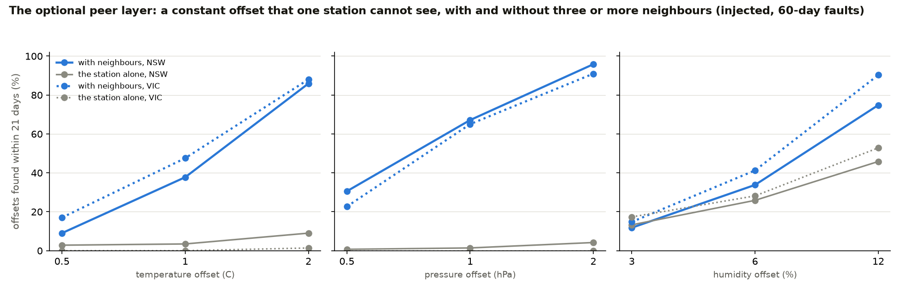

# The optional peer layer: constant offsets and slow drift

**The limit it removes.** A single station, judged only against its own history, cannot see a sensor that was 1 hPa high from the day it was installed, or one that
drifted 2 C over two months: the offset becomes part of its "normal". `docs/WHAT_WE_DO_NOT_CLAIM.md` says so and the drift monitor states the smallest drift it can see.
Neighbouring stations weather the same synoptic systems, so a station's *departure from its own normal* moves with its neighbours' departures. When it stops doing so
and stays apart, the sensor has moved.

**This is optional and outside the core.** The problem statement is one station from T, P and RH alone, and the core pipeline stays exactly that. The peer layer is
for a network that can supply neighbours: `atmos/peers.py`, off unless used. It does nothing for a lone station in the Andamans or Ladakh, and it says so by returning
no result when fewer than three neighbours have a reading.

## How it works
1. **Anomaly** = reading minus the station's own smooth normal (the same month x hour table the pipeline already fits). This removes elevation and local climate, so
   neighbours need not be alike.
2. **Difference** = own anomaly minus the *median* of the neighbours' anomalies at the same hour (neighbours within 250 km, at least three with a valid reading). A median
   is not moved by one bad neighbour.
3. **Alarm** = the 7-day mean of the difference is beyond a limit learned from the station's clean 2016-2019 years: the 99.5th percentile of the absolute 7-day mean, times
   1.1. It is the same construction as the station-learned limits in `atmos/limits.py`; nothing is tuned on the faults.

## Evidence (injected faults; a study on dense networks, not a claim about sparse ones)
Two disjoint clusters of twelve Australian Bureau of Meteorology automatic weather stations, hourly at 0.1 C and 0.1 hPa, 2016-2024 (`data_tools/stations_peers_nsw.yaml`,
`stations_peers_vic.yaml`; central-west New South Wales and northern Victoria, none in any sealed set). Each station is trained on 2016-2019. Into 2020-2023, at random start
times, 60-day constant offsets of three sizes per channel and 60-day linear drifts are injected (12 starts per station, size and channel, 12 stations). An offset counts as
detected if the fault raised an alarm within 21 days of its start (paired, as in Amendment 1: an alarm that was already there without the fault does not count); a drift, within
its 60 days. Each cell: detected share (detected/trials, median days to the alarm). *Alone* is the same statistic on the station's own anomaly with no neighbours, which is all
a single station has.

**The settings were fixed on the NSW cluster, then run unchanged on the VIC cluster.** Four settings were tried on NSW (7 or 14 days, 99th or 99.5th percentile); the one
kept is the most sensitive whose false-alarm share stays at or below 1 % of days in every channel with neighbours. The VIC column is the check on it.



<!-- PEERS:START -->
| fault (60 days long) | NSW: with neighbours / alone | VIC: with neighbours / alone |
|---|---|---|
| temperature offset of 0.5 C | 9% (13/144, 7 d) / 3% (4/141, 12 d) | 17% (24/141, 12 d) / 0% (0/141) |
| temperature offset of 1 C | 38% (54/143, 7 d) / 3% (5/144, 10 d) | 48% (68/143, 8 d) / 0% (0/144) |
| temperature offset of 2 C | 86% (122/142, 6 d) / 9% (13/144, 7 d) | 88% (125/142, 5 d) / 1% (2/144, 8 d) |
| temperature drift, 0 to 2 C | 82% (118/144, 40 d) / 3% (5/144, 42 d) | 84% (120/143, 36 d) / 3% (5/143, 48 d) |
| pressure offset of 0.5 hPa | 31% (44/144, 10 d) / 1% (1/140, 19 d) | 23% (32/141, 12 d) / 0% (0/143) |
| pressure offset of 1 hPa | 67% (96/143, 6 d) / 1% (2/141, 11 d) | 65% (93/143, 7 d) / 0% (0/143) |
| pressure offset of 2 hPa | 96% (138/144, 4 d) / 4% (6/143, 9 d) | 91% (131/144, 5 d) / 0% (0/143) |
| pressure drift, 0 to 2 hPa | 94% (135/143, 32 d) / 3% (4/143, 19 d) | 90% (128/142, 35 d) / 1% (2/143, 38 d) |
| humidity offset of 3 % | 12% (17/144, 9 d) / 13% (19/143, 6 d) | 15% (21/142, 9 d) / 17% (25/144, 8 d) |
| humidity offset of 6 % | 34% (48/142, 9 d) / 26% (37/143, 11 d) | 41% (59/143, 8 d) / 28% (40/142, 8 d) |
| humidity offset of 12 % | 75% (107/143, 6 d) / 46% (66/144, 7 d) | 90% (130/144, 5 d) / 53% (74/140, 8 d) |
| humidity drift, 0 to 12 % | 69% (99/144, 36 d) / 47% (68/144, 33 d) | 90% (128/143, 35 d) / 61% (88/144, 31 d) |

| share of clean days with an alarm | NSW: with neighbours / alone | VIC: with neighbours / alone |
|---|---|---|
| temperature | 0.52% / 2.60% | 0.62% / 0.43% |
| pressure | 0.95% / 0.77% | 0.20% / 0.30% |
| humidity | 0.96% / 2.36% | 2.45% / 3.09% |

<!-- PEERS:END -->

A "quiet" setting (99.9th percentile x 1.2) is in `results/peers_*_quiet.*`: false alarms below 0.25 % of days on NSW and below 0.75 % on VIC, at the cost of a large part of the
detection at small and medium sizes (a 1 hPa offset: 40 % instead of 67 % on NSW, 32 % instead of 65 % on VIC).

## What it does not do
- **Small offsets.** Half a degree, half a hPa and 3 % humidity are mostly missed even with neighbours, and humidity is weak throughout (its departures are local: fog, irrigation, a
  different exposure). Pressure is the strong channel, temperature next.
- **False alarms are not zero.** About 1-2 % of clean days carry a peer alarm in the humidity channel (2.4 % on VIC, above the 1 % the NSW rule targeted), and it is a review flag, not a fault.
- **A fault that moves all the neighbours too** (a common calibration error, a network-wide change of instrument) is invisible to it.
- **It needs a network.** At least three neighbours within 250 km, all reporting; a sparse network gets nothing. Whether India's AWS network is dense enough in a given region is
  a question about the network, not about this code.
- **The faults are injected** (into the anomaly series), and the stations are Australian. It is a mechanism and a measurement on real weather, not a field trial.

## Reproduce
```bash
python -m data_tools.make_peers --cluster nsw && python -m data_tools.make_peers --cluster vic
python evaluate_peers.py --cluster nsw --quantile 0.995 --margin 1.1 --out results/peers_nsw.json
python evaluate_peers.py --cluster vic --quantile 0.995 --margin 1.1 --out results/peers_vic.json
python make_summary.py results/dev_run4.json ... --peers results/peers_nsw.json results/peers_vic.json --peers-doc docs/PEER_LAYER.md   # refreshes the tables above
```
For a cluster of your own: a catalog like `data_tools/stations_peers_nsw.yaml` (identity and coordinates) and one CSV per station in `data/peers/<cluster>/`.
