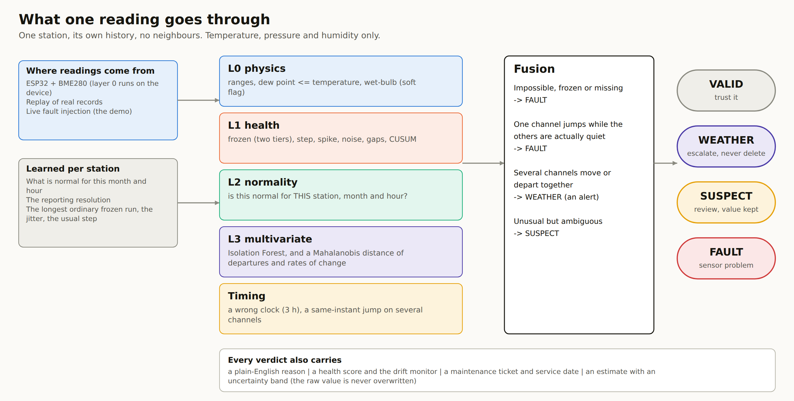
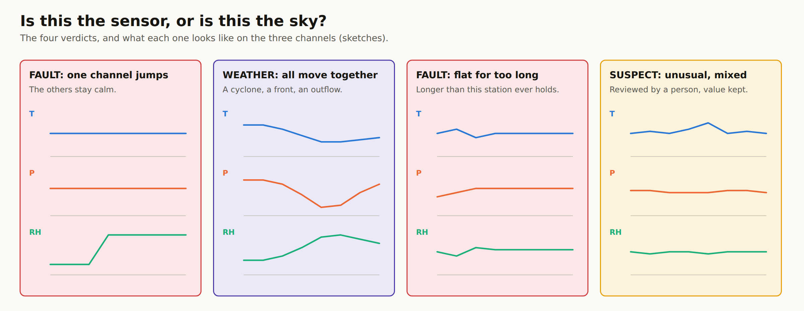
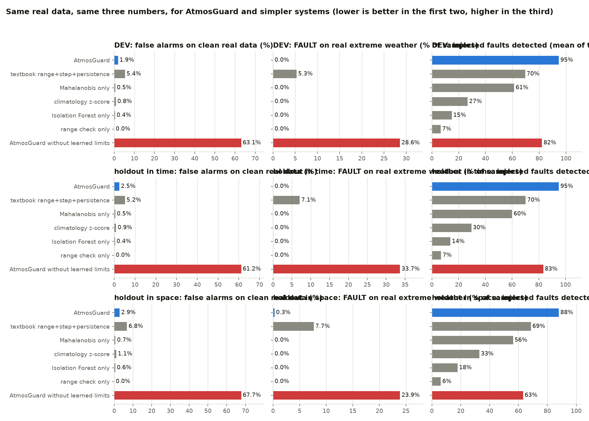
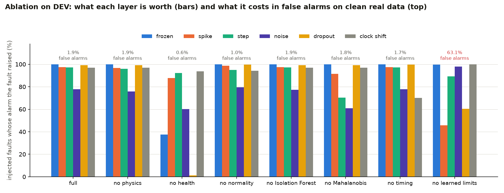
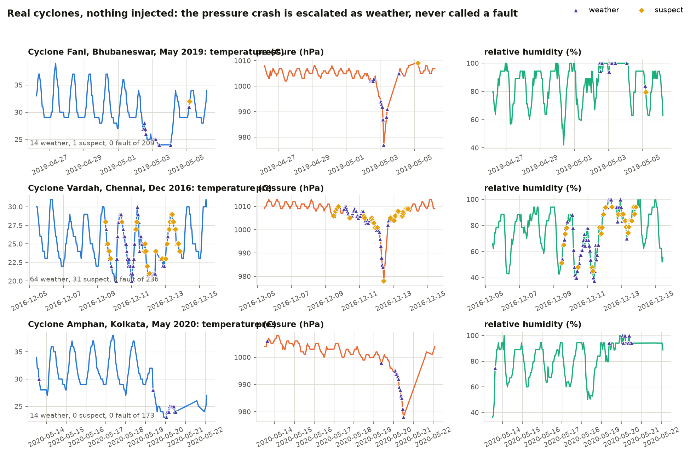
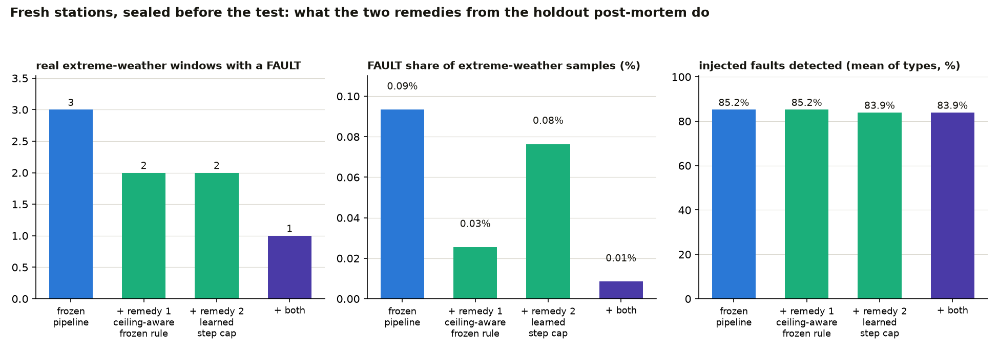
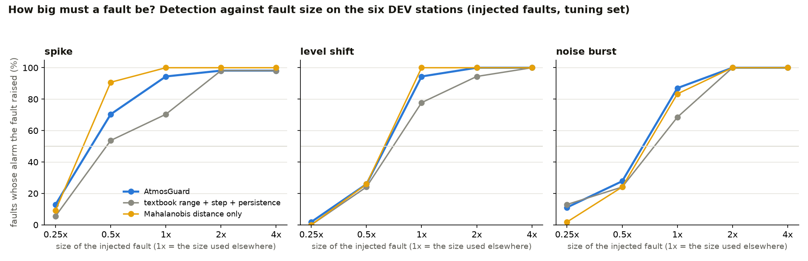
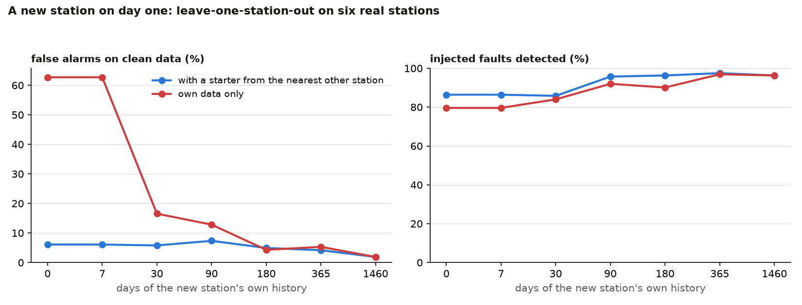
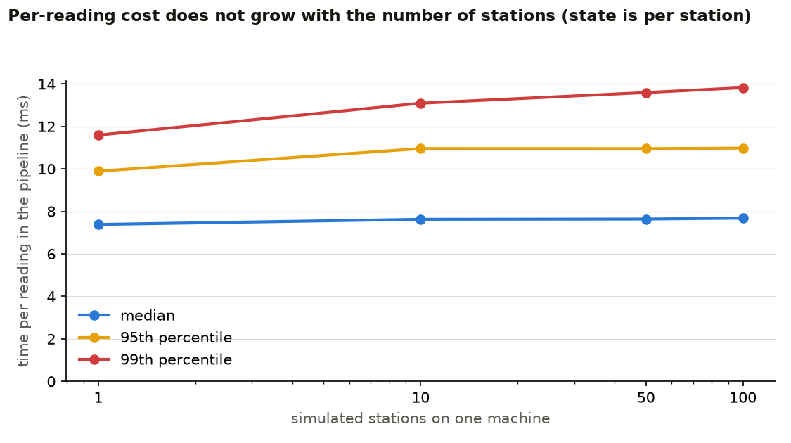
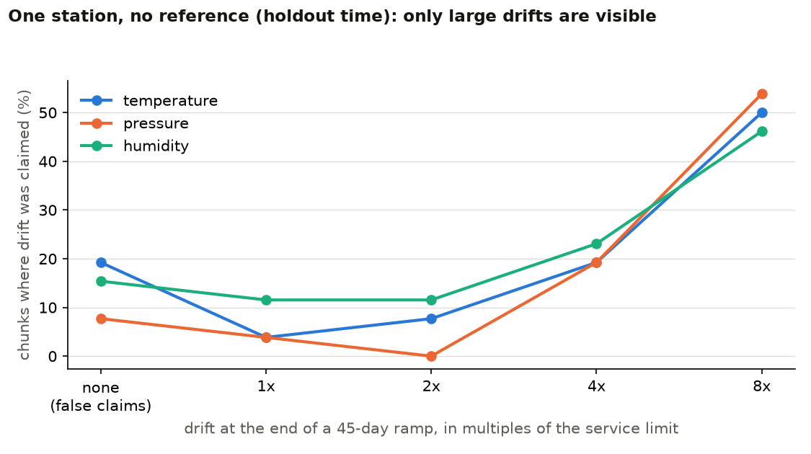

# AtmosGuard: telling a broken sensor from real weather at one automatic weather station

**Technical report.** Smart India Hackathon 2026, problem statement 26073. Repository: <https://github.com/Mahim56207/ATMOSGUARD>. Every number below is generated from the committed result files (`results/`), which are produced by the commands in `results/RUNS.md`.

## Abstract

AtmosGuard judges every temperature, pressure and humidity reading of a single automatic weather station, with no neighbouring stations, as `VALID`, `WEATHER`, `SUSPECT` or `FAULT`, and says why. Real extreme weather is escalated as its own verdict and is never deleted as noise. We claim no new algorithm; the contribution is the integration for one station and an evidence standard: 26 real Indian airport stations (NOAA ISD, 2016-2024), a protocol committed before a holdout that is sealed in time and in space, false alarms on real cyclones reported separately from injected-fault scores, baselines and an ablation on the same data, and the failures kept on record. After the holdout showed three real-weather failure windows, we registered a decision rule and tested the proposed remedies on twelve further stations nobody had looked at: one remedy was adopted and one rejected. Headline results:

- **DEV (tuned here).** Clean data: 1.9% (1.8-2.0) of 98340 samples got FAULT or SUSPECT; 0.0% (0.0-0.0) got FAULT. Real extreme weather: FAULT on 0.0% (0.0-0.1) of 3503 samples (0 of 30 windows); WEATHER on 10.8%, SUSPECT on 9.0%.
- **holdout in time (same six stations, 2022-2024).** Clean data: 2.5% (2.4-2.6) of 147078 samples got FAULT or SUSPECT; 0.0% (0.0-0.0) got FAULT. Real extreme weather: FAULT on 0.0% (0.0-0.1) of 4374 samples (0 of 38 windows); WEATHER on 11.8%, SUSPECT on 8.2%.
- **holdout in space (eight unseen stations).** Clean data: 2.9% (2.8-3.0) of 237411 samples got FAULT or SUSPECT; 0.0% (0.0-0.1) got FAULT. Real extreme weather: FAULT on 0.3% (0.2-0.4) of 9074 samples (3 of 98 windows); WEATHER on 15.7%, SUSPECT on 8.6%.
- **fresh stations (twelve more, sealed before the remedies were tested).** Clean data: 2.5% (2.5-2.6) of 364440 samples got FAULT or SUSPECT; 0.1% (0.1-0.1) got FAULT. Real extreme weather: FAULT on 0.1% (0.1-0.2) of 11782 samples (3 of 139 windows); WEATHER on 10.3%, SUSPECT on 6.8%.

Detection is measured on **injected** faults, because no labelled real faults exist; the data are airport records, not IMD AWS records; and on the unseen stations a small number of real extreme-weather windows did receive a `FAULT` verdict (3 of 98 on the eight holdout stations, 3 of 139 on the twelve fresh ones; Section 5). Sections 5 and 6 say exactly what we cannot show.

## 1. Introduction

### 1.1 The problem
An Automatic Weather Station (AWS) reports temperature, pressure and humidity every few minutes, often from places nobody visits.
A failing sensor and real weather look alike on a chart: a barometer that has stuck reads the same flat line as the calm before a
cyclone, and the sharp pressure fall of a cyclone reads like a barometer that has failed. A system that silences every surprise
deletes the storm the network exists to see; a system that trusts every surprise sends bad data into forecasts and warnings.
Problem statement 26073 asks for anomaly detection and sensor-health monitoring **from these three channels only**.

We accepted two constraints beyond the statement, because they are what sparse networks (the Andamans, Ladakh, the Thar) actually have:
one station is judged on its own record, with **no neighbouring stations and no reanalysis**; and **no fault labels**, because
no public labelled record of real AWS faults exists.

### 1.2 What we built
AtmosGuard judges every reading with one of four verdicts, `VALID | WEATHER | SUSPECT | FAULT`, and gives the reason in words. Real
weather is **escalated as an alert (`WEATHER`), never deleted as noise**. A raw value is never overwritten; an estimate for a missing
or faulty value is stored beside it with an uncertainty band. Around the verdicts sit a health score, a drift monitor with a stated
detectability floor, a maintenance ticket with a projected service date, live fault injection for the demonstration, and an ESP32
node whose first layer is one portable C++ header that the tests compile and compare with the Python (Section 3).

### 1.3 What we claim, and what we do not
**We do not claim a new algorithm.** Physics checks, persistence tests, CUSUM, Isolation Forest, Mahalanobis distance, SHAP and
weather-versus-fault discrimination are standard, and Section 7 says where each comes from. We claim an **integration** built for one
station with no neighbours that copes with the rounded values real stations report, and an **evidence standard**: real records from 14
Indian stations, a holdout sealed in time and in space with the protocol committed first, false alarms on real cyclones reported
separately from injected-fault scores, baselines and an ablation on the same data, and the failures kept on record. Section 6 lists what
we cannot show.

### 1.4 Reading guide
Section 2 describes the data and the protocol. Section 3 describes the method. Section 4 gives the results exactly as the evaluation
program wrote them, in five separate numbers that are never merged. Section 5 explains what the holdout found that development did not.
Section 6 is the limitations. Section 7 is related work and what is ours. Section 8 shows how to reproduce everything.




*Figure 1. What one reading goes through.*



*Figure 2. The four verdicts and what each looks like on the three channels (sketches).*

## 2. Data and evaluation protocol

### 2.1 Data
Records are NOAA Integrated Surface Database (ISD) hourly METAR and 3-hourly SYNOP reports for 14 Indian airports, 2016-2024,
downloaded from NOAA's public open-data bucket. We take temperature, dew point and pressure only. **Humidity is computed from
temperature and dew point** (Magnus formula), because ISD carries no relative humidity. METAR values are rounded to whole degrees and
whole hPa. These are airport observations, not IMD AWS records; every number in this report inherits that caveat. NOAA's own quality
code for each value is kept only as a weak label for an agreement table; it never influences a verdict.

### 2.2 Split
Every station is trained on its own 2016-2019 record with extreme-weather windows and NOAA-flagged values removed. Six stations
(Bhubaneswar, Chennai, Kolkata, Delhi, Jaipur, Thiruvananthapuram) are the **DEV** set: 2020-2021, where tuning was allowed. The
**holdout in time** is the same six stations in 2022-2024. The **holdout in space** is eight stations that were never used for any
tuning: Ahmedabad, Nagpur, Mumbai, Guwahati, Visakhapatnam (hourly) and Port Blair, Bhuj, Cochin (3-hourly SYNOP), 2020-2024.
The protocol (`config/protocol.md`) was committed before the holdout was read; the evaluation program refuses to read the sealed
files unless that file is tracked and unmodified, and it writes a lock file when it runs.

### 2.3 Extreme-weather windows
Windows are chosen by rule on the data, before any verdict is looked at: the deepest low-pressure episodes (at least 10 hPa below
the trailing 30-day median), the hottest and coldest days (top and bottom 0.3 %), and the sharpest 3-hour temperature change of each
year. Real cyclones fall out of the rules without our choosing them: Amphan (Kolkata, 2020) is judged in DEV; Tauktae (Mumbai and
Ahmedabad, 2021), Biparjoy (Bhuj, 2023), Michaung (Chennai, 2023) and Remal (Kolkata, 2024) in the holdouts. Vardah (2016) and Fani (2019)
fall in the training years, so they are cut out of training and used for the demonstration replay, not for a reported number.
A `FAULT` verdict inside such a window is counted as a failure: real weather was called a broken sensor.

### 2.4 The five numbers
1. **Detection of injected faults**, per type (frozen 48 h, spike, level shift 24 h, noise burst 24 h, dropout, clock 3 h out for 4 days).
2. **False alarms on clean real data** (nothing injected).
3. **Real extreme weather** (nothing injected): FAULT, SUSPECT, WEATHER and VALID shares, and windows containing a `FAULT`.
4. **Agreement with NOAA's flags**, described as consistency with another automated system, not accuracy.
5. **Slow drift** through the health monitor, including false drift claims.
plus speed. Each is computed for the full pipeline, for seven ablations (one layer off by its config flag) and for five baselines
(range only; textbook range + step + persistence; climatology z-score only; Isolation Forest only; Mahalanobis distance only), fitted on
the same training data.


### 2.5 What was changed after looking at DEV (the tuning log, from `config/protocol.md`)

Every change below was made against DEV stations and years only, and each was checked not to reduce detection of injected faults.

| # | Change | Why (measured on DEV) |
|---|---|---|
| 1 | Station-learned frozen and noise limits (`atmos/limits.py`) | fixed limits alarmed on 63.1 % of clean samples and gave FAULT on 28.6 % of real extreme-weather samples (30 of 30 windows) |
| 2 | Frozen is graded: soft just past the learned limit, hard at twice it | a pressure plateau inside a real cyclone read as a frozen barometer |
| 3 | Communication gaps are notices, not verdict changes | the healthy reading after a gap was counted as a false alarm |
| 4 | Drift monitor: daily means, smooth expected value, autocorrelation-aware test, isolated-trend rule, 7-day persistence, 60-day window | the first version claimed drift on 97.7 % of station-days; now 1.1 % |
| 5 | Rule 2 ("one channel jumped, the others are quiet") requires the others to be actually quiet | 2 of 30 real windows had a FAULT: real thunderstorm outflows (Kolkata, Delhi) where an un-flagged 8-12 C fall counted as "quiet" |
| 6 | Mahalanobis layer (departures from normal + rates of change) | level-shift detection 74 % and noise 66 % without it; 97 % and 81 % with it, false alarms unchanged. The Isolation Forest contributes almost nothing in the ablation and is kept because the guide lists it |
| 7 | WEATHER also when two or more channels depart from normal together (level, not only movement) | most SUSPECT verdicts in real extreme windows showed no movement in the last hour; detection of injected faults unchanged |
| 8 | Clock check recomputed every 3 hours of data time instead of every reading | 4.6x faster evaluation; a wrong clock lasts days |
| 9 | "Quiet" in rule 2 is also judged against the station's learned usual step (1.5 x its 75th percentile) | on a 3-hourly copy of a DEV station, 5 of 2,695 clean samples got FAULT: day/night swings where a 5 C fall (under the step cap) let derived humidity jump. Now 0. The copy was made from DEV data only; no sealed station was read to find this |

DEV result after the changes (`results/dev_run3.txt`, the final code): clean false alarms 1.9 % (FAULT 0.0 %) over 98,340 samples; real extreme weather: FAULT
0.0 % (0 of 30 windows), WEATHER 10.8 %, SUSPECT 9.0 %; detection: frozen 100 %, dropout 100 %, spike 98.8 %, level shift 97.1 %,
clock shift 96.8 %, noise burst 80.7 %.

### 2.6 Amendment 1: how detection is scored (from `config/protocol.md`)

`results/holdout_run1.*` was produced under the criterion registered above and is kept unedited. Afterwards we found a flaw in how
**detection is scored**, not in the pipeline: "any alarm in the fault window" also credits background false alarms (about 2 % of
samples) that land inside long windows. Over a 4-day clock-shift window that alone gives about an 84 % chance of some alarm, and the
simpler baselines get the same free credit (the climatology-only baseline "detects" 53-61 % of clock shifts almost entirely from its
background alarms). The scoring is corrected and both scores are reported:

- **Registered criterion** (unchanged): any `FAULT` or `SUSPECT` from the first faulty sample to the last plus 60 minutes.
- **Corrected criterion (now the primary detection table):** the same window, but an alarm counts only if the *same sample* was not an alarm on the
  un-faulted series ("the fault raised it"). Also reported: how often the alarm is a `FAULT` (named) and how often a miss made samples look like
  `WEATHER` (the risk of the coherent-level route).

To score it, DEV (`dev_run4`) and the holdout (`holdout_run2`, run with `--force-rerun-holdout`; the original lock file stays in git history) were run
again on the same code. Nothing about the pipeline or its settings changed between `holdout_run1` and `holdout_run2`
(`git diff 9cd24f1 HEAD -- atmos config/settings.yaml` shows only a new `explain.py`, an optional retention method and an `api:` block). The rerun is deterministic, so
its registered-criterion numbers must equal `holdout_run1`'s; `results/RUNS.md` records whether they do.

`holdout_run1` also showed what a holdout is for: on the eight unseen stations 3 of 98 real extreme-weather windows contain a `FAULT` verdict (0.3 % of
their samples), where DEV had none. No change was made in response. It is listed as a limitation and analysed in `docs/TECHNICAL_REPORT.md`.

### 2.7 Amendment 2: testing the post-mortem remedies on twelve unseen stations (from `config/protocol.md`)

`docs/HOLDOUT_POSTMORTEM.md` explained the three real-weather windows that got a `FAULT` on the sealed holdout and proposed two remedies, and said
they could not be evaluated honestly on the stations that revealed the problem. This amendment sets up that evaluation on data nobody has looked at.
`evaluate_real.py --fresh` refuses to run unless this amendment is in the committed `config/protocol.md` (guard `evaluate.guard_fresh`, lock file
`data/fresh/.fresh_used`); a second run is refused, as for the holdout; `replay.py` refuses `data/fresh/`.

**The stations.** Twelve Indian airport stations that were not used for training, tuning, DEV, the holdout, the demo or the post-mortem:
Lucknow, Patna, Indore, Ranchi, Coimbatore, Mangalore, Tiruchirappalli, Amritsar (hourly METAR) and Pune, Goa, Raipur, Jodhpur (3-hourly SYNOP),
listed in `data_tools/stations_fresh.yaml`. The list was fixed from a coverage scout of the year 2022 only (how many reports carry temperature, dew
point and pressure) and their identity in the raw files. No AtmosGuard verdict was computed on any of them before this amendment. Coverage varies
(Indore has 42-69 % of the expected hours in the training years); gaps stay gaps.

**The code.** The two remedies exist behind flags that are off in `full`, so `full` is the pipeline of the holdout, unchanged
(`git diff 9cd24f1 HEAD -- atmos config/settings.yaml` shows the new `explain.py`, an optional retention method, an `api:` block, and these flags with their
tests). Remedy 1 (`health.frozen.ceiling_aware`): a frozen humidity pinned at 99.5 % or more, or a frozen temperature while humidity was at or above 99.5 %
for the whole window, is a `SUSPECT`-level flag at most; a frozen barometer stays hard. Remedy 2 (`limits.learned_step_cap`): the step cap for a channel is
the larger of the configured cap and 1.1 times the 99.9th percentile of that station's own |change| between consecutive clean readings (gaps up to the
gap limit included). Configurations evaluated: `full`, `remedy_frozen`, `remedy_step`, `remedies` (both), the seven ablations and the five baselines.

**The data and the numbers.** Same layout and rules as the holdout in space: each station is trained on its own 2016-2019 record (extreme-weather
windows and NOAA-flagged values removed) and judged on 2020-2024; the extreme-weather windows come from the same rules (`data/fresh/events.json`); the
same five numbers are reported, detection under the paired criterion of Amendment 1 (the registered criterion is printed beside it).

**Decision rule, registered now.** On the FRESH stations pooled, a remedy (or both) is adopted as the recommended configuration only if
(a) the number of real extreme-weather windows containing a `FAULT` is not higher than with `full` and the share of `FAULT` samples in those windows does
not rise; (b) paired detection is not lower than with `full` by more than 2 percentage points for any injected-fault type; and (c) false alarms on clean data
do not rise by more than 0.2 percentage points. "Adopted" means the flag is switched on in `config/settings.yaml`, the six committed station models are
retrained, and the remedy is described as validated on unseen stations. Otherwise `full` stays the shipped configuration and the remedy is reported as tested and
rejected. Each remedy is judged on its own by the same rules, so the report can say which one earned adoption.

**What is reported whatever happens.** Every table for every station, for `full` and for the remedies, including any station where a remedy is worse.

**What this is not.** It is not a repeat of the registered holdout. `full` on the FRESH stations is one more out-of-sample number for the frozen pipeline.
The remedies are deliberately not run on DEV or on the earlier holdout: the post-mortem read those windows to design them, so those numbers would be
contaminated and are not evidence. These are airport records again, and injected faults again.

### 2.8 Amendment 2: outcome (from `config/protocol.md`)

`results/fresh_run1.*` was produced by the single run behind the guard (lock `data/fresh/.fresh_used`, protocol commit `aec7b6f`). The decision rule
registered above was applied by `make_summary.py` (`remedy_rows`) to the pooled numbers of the twelve stations, and every number is printed in
`results/REPORT.md` under "The two remedies from the post-mortem":

| | (a) windows with a FAULT (full / this, of 139) | (a) FAULT share of extreme-weather samples | (b) worst change in paired detection | (c) change in clean false alarms | adopt |
|---|---|---|---|---|---|
| remedy 1, ceiling-aware frozen rule | 3 / 2 | 0.09 % / 0.03 % | none | 0.00 pp | **yes** |
| remedy 2, learned step cap | 3 / 2 | 0.09 % / 0.08 % | -4.2 pp (clock 3 h out) | -0.18 pp | **no** (rule b) |
| both | 3 / 1 | 0.09 % / 0.01 % | -4.2 pp (clock 3 h out) | -0.18 pp | **no** (rule b) |

**Decision.** By the registered rule, remedy 1 is adopted: `health.frozen.ceiling_aware` is `true` in `config/settings.yaml`. Remedy 2 is rejected and
`limits.learned_step_cap` stays `false`. The six committed station models need no retraining (remedy 1 fits nothing). The evaluation's `full`
configuration, the ablations and the baselines keep both flags forced off (`evaluate_real.build_configs`), so `dev_run4`, `holdout_run1/2` and `fresh_run1`
reproduce with the shipped default; the remedy rows are the only ones with a flag on. On DEV, `results/dev_check_remedies.*` shows the shipped default
changes nothing there: identical counts for clean data, extreme weather and every injected-fault type.

**What the three FAULT windows of the frozen pipeline were** (`python window_forensics.py --phase FRESH --station <STN>`; read only after the results were fixed):
Ranchi, a low-pressure window in May 2021: humidity pinned at 100 % for more than 35 hours (`frozen:humidity_pct`, hard): the same cause as Visakhapatnam,
and the one remedy 1 removes. Coimbatore, a sharp-change window in February 2021: humidity up 47.3 % in 120 minutes against a 40 % cap (`step:humidity_pct`),
one sample. Jodhpur, a sharp-change window in December 2020: temperature up 16.2 C across a 6-hour reporting gap and 13 C across a 9-hour one, against a 10 C
cap (`step:temperature_c`): the same cause as Bhuj. Remedy 2 would remove the last two and costs 4.2 points of wrong-clock detection, because the same fixed
step cap is what flags the jump when a clock goes wrong; the rule registered first says that is too much.

**What the frozen pipeline did on the twelve stations, for the record:** clean false alarms 2.5 % (FAULT 0.1 %); extreme weather FAULT on 0.1 % of samples
(3 of 139 windows), WEATHER 10.3 %; paired detection frozen 99 %, spike 91 %, level shift 80 %, noise burst 57 %, dropout 98 %, clock 85 %. That is lower than
on DEV for level shift, noise bursts and clocks, in line with the first holdout, and two simpler systems are better at some fault types on these stations: a
Mahalanobis-only detector on spikes and level shifts, and the textbook rules on wrong clocks (94 % against 85 %) and noise bursts (63 % against 57 %), at 8.4 % false
alarms and a FAULT in 134 of 139 real extreme-weather windows.

## 3. Method

AtmosGuard judges one reading at a time. State is per station; no station ever reads another's live data. Every threshold below
is a value in `config/settings.yaml` (nothing is hard-coded), and every layer has a switch, so the ablation needs no code edits.
The layers are ordered by cost; a fusion step turns their outputs into one of four verdicts.

### 3.1 L0 physics (closed form; also runs on the ESP32)
- **Range:** temperature -90..60 degC, pressure 300..1100 hPa, humidity 0..100 %. Outside is a hard flag.
- **Dew point** (Magnus, a = 17.62, b = 243.12 degC): g = ln(RH/100) + a T/(b+T), Td = b g/(a-g). Td above T + 0.5 degC is a hard flag.
- **Wet-bulb** (Stull 2011). At or above 35 degC it is a **soft** flag only. It is not an "impossible" rule: 35 degC wet-bulb has been observed.

### 3.2 L1 health (per channel; windows are in minutes and scale with the station's cadence)
- **Frozen.** No change over a window. The configured window (T 60, P 180, RH 120 min, at least 3 samples) is stretched to the
  longest run of identical values this station's clean history produced (section 3.3). Two tiers when the window was learned: a
  run past the limit is a **soft** flag; a run `2x` the limit is a **hard** flag.
- **Step / spike.** Allowed change = min(rate x minutes, cap): rates 1 degC, 0.5 hPa, 5 % per minute; caps 10, 10, 40. A spike is a
  one-sample excursion that returns.
- **Noise.** Jitter from **second differences** (which cancel a smooth trend): sqrt(mean(d2^2) / 6), over a window of at least 7 samples.
  Limit: configured (0.5, 0.5, 3.0) or learned, whichever is larger.
- **Gap.** More than 3 cadences since the last reading. Reported as a **notice** on the next reading; it does not change the verdict
  (the values after a gap are fine).
- **CUSUM** on (reading - expected) in normality sigmas, k = 1.5, h = 40, one sample capped at 4 sigma, steps scaled by cadence/15 min.
  A soft flag: real weather anomalies last hours and look like drift.

### 3.3 Station-learned limits (`atmos/limits.py`)
A station that reports whole degrees repeats the same value for hours in ordinary weather. On real Bhubaneswar METAR the fixed
limits alarmed on two thirds of clean samples. For each channel the station's own clean history gives:
the **reporting resolution** (1.0, 0.5, 0.1 or none), the 99.9th percentile of identical-value **run durations**, the 99.9th percentile
of the **noise estimate** (times 1.1), and the **usual step** (75th percentile of |change| between consecutive readings).
The configured values are a floor: learning can only relax a check. The frozen-run idea is HadISD's (streak thresholds from the
distribution of run lengths); the two-tier grading, the resolution detection and the real-time use are ours.

### 3.4 L2 normality (`atmos/normality.py`)
A table of mean, standard deviation and count per station x month x hour (cells with fewer than 10 samples are left out). The
z-score of a reading is (value - mean) / max(std, floor); |z| > 4 is a soft flag. A **smooth expected value** (bilinear in hour and
in month, each month's value taken at mid-month) is used wherever residuals are read over weeks, because the plain table is a step
function and turns the seasonal cycle into a fake trend.

### 3.5 L3 multivariate
- **Isolation Forest** (100 trees, one per station, fixed seed) over the three values, their per-minute changes and the hour as sin/cos;
  alarm below the 0.5 % quantile of the clean training scores.
- **Mahalanobis distance** of the six-vector (departure from the smooth expected value, per-minute change) for each channel, with the
  station's own covariance; alarm above the 99.5 % quantile of the clean training distances. The squared distance splits **exactly**
  into per-feature contributions, so the flag names the channel and feature that drove it.

### 3.6 Timing
- **T1 clock phase:** the daily cycle of the last day is compared with the station's normal cycle at timestamp shifts of -6..+6 whole
  hours; if a non-zero shift cuts the mean squared z by at least half, the clock may be wrong (soft flag). Recomputed every 3 hours of data time.
- **T2 co-jump:** two or more channels exceeding their step limit in the same sample (common-mode glitch). Meaningful only at fast
  cadence; weak on hourly data, and the README says so.

### 3.7 Fusion (first rule that matches wins)
1. A **hard** flag from range, dew point, frozen (at 2x the learned limit) or dropout -> `FAULT`.
2. **One** channel jumps (step or spike) and the other two are **actually quiet** -> `FAULT`. Quiet means each other channel moved by at
   most half of its step allowance over the last two intervals and, once known, at most 1.5x the station's usual step. (Checking only that no
   flag fired was a real bug: a thunderstorm outflow that drops temperature 8 degC fires nothing and made rule 2 call weather a fault.)
3. Only soft flags, and either (a) two or more channels **move** together over the last hour by more than a minimum (T 1 degC,
   P 1 hPa, RH 5 %) in a known pattern (cooling + moistening; warming + drying; falling pressure + rising humidity; rising pressure +
   drying), or (b) two or more channels **depart from normal together** (|z| >= 2) -> `WEATHER`, escalated as an alert.
4. Any other flag -> `SUSPECT` (kept, marked for review).
5. Otherwise `VALID`.

The reason text is built from the checks that fired. **Confidence** is a heuristic agreement score (0.9 valid, 0.95 rule 1, 0.8 rule 2,
0.7 weather, 0.5 suspect, +0.05 per extra supporting soft flag, capped at 0.99). It is **not** a probability and no metric uses it.

### 3.8 Health monitor and drift (`atmos/healthscore.py`)
- **Score** per channel over 7 days = 100 - 100 x (fraction of FAULT verdicts on it) - 50 x (fraction of SUSPECT) - 40 x (drift ratio);
  the station score is the worst channel. `WEATHER` never counts against a sensor.
- **Drift.** Daily means of (reading - smooth expected value), residuals clipped at 3 normality sigmas, samples judged FAULT on that
  channel left out. Over the last 60 days (at least 21 usable days): Theil-Sen slope; significance = OLS slope / a standard error inflated
  by sqrt((1+rho)/(1-rho)), rho the lag-1 autocorrelation of the fit residuals (0..0.9); significant at |z| >= 4.
  **Isolated-trend rule:** if another channel also trends (|z| >= 2.5) the trend is read as a seasonal or weather transition, not drift.
  **Persistence:** significant with the same sign on each of the last 7 daily evaluations.
  The monitor reports the **smallest slope it could see** (z_crit x standard error) so "no drift found" has a stated meaning.
  Service date = when the offset reaches the limit (T 0.5 degC, P 1 hPa, RH 3 %) at the fitted slope.
- **Ticket** when the score is at or below 60, a channel is faulty in at least half of the last hour, or a service date is within 30 days.

### 3.9 Estimate for a missing or faulty value (`atmos/impute.py`)
estimate = normal(t) + rho x (last trusted value - normal(then)), rho = 0.5^(age / 120 min); band = +/- 1.96 sqrt(std^2 (1-rho^2) + (1+rho^2) sigma^2),
sigma the sensor noise floor. It is stored **beside** the raw value; the raw value is never replaced.

### 3.10 Edge (`firmware/node/atmos_l0.h`)
1 Hz sampling, per-sample range check, one-minute mean of the valid samples (at least 30), dew point vs temperature, and a counter of identical
minute means (30 in a row -> frozen flag), with a queue of 30 unsent minutes while the network is down. The header is plain C++11
with no Arduino dependency, so the same code is compiled and compared with the Python implementation on thousands of inputs
(`tests/test_edge_parity.py`). It has not been run on hardware.

### 3.11 Cold start (`atmos/coldstart.py`)
A new station borrows the frozen table and limits of the nearest other station and blends them cell by cell with its own as its own
data grows (weight = samples in the cell / 30; limits over 365 days). No live neighbour data is read.

## 4. Results

Everything in this section is generated by `make_summary.py` from the JSON that `evaluate_real.py` wrote, and is copied here by `make_report.py`; nothing is typed by hand. **The five numbers are never merged**: the injected-fault score, the false-alarm rate on clean data, what happens to real extreme weather, agreement with NOAA's flags, and drift are different questions. Injected faults are injected; NOAA's flags come from another automated system, not from truth.

### 4.1 DEV: the six stations we were allowed to tune on, 2020-2021

*Tuning happened here. These numbers are the optimistic ones.* Stations: BBI, MAA, CCU, DEL, JAI, TRV.

#### Headline

Five separate numbers. They are never merged.

| question | answer |
|---|---|
| False alarms on clean real data (nothing injected) | 1.9% (1.8-2.0) of 98340 samples got FAULT or SUSPECT; 0.0% (0.0-0.0) got FAULT |
| What happens to real extreme weather (cyclones, heat, cold, sharp fronts; nothing injected) | FAULT on 0.0% (0.0-0.1) of 3503 samples (0 of 30 windows); WEATHER on 10.8%, SUSPECT on 9.0% |
| Injected faults whose alarm the fault raised (each type on its own; injected, not real) | frozen 100%; spike 98%; level shift 97%; noise burst 78%; dropout 99%; clock 3 h out 97% |
| Agreement with NOAA's own quality flags (another automated system, not ground truth) | escalated (FAULT, SUSPECT or WEATHER) on 66.9% of 236 NOAA-flagged values (FAULT or SUSPECT alone: 22.9%); escalated on 4.7% of the 101736 values NOAA left alone |
| Slow drift (health monitor, single station, no reference) | false drift claims on 1.1% of 3859 station-days; an injected ramp reaching 8x the service limit was found in 56% of trials |

#### 1. Detection of injected faults, by type (the fault raised the alarm)

Alarm = FAULT or SUSPECT on a sample that was NOT an alarm on the same series without the fault (paired), from the first faulty sample to the last plus 60 minutes. The faults are injected, not real. Ablation rows switch one layer off; baseline rows are simpler systems on the same data.

| configuration | frozen | spike | level shift | noise burst | dropout | clock 3 h out |
|---|---|---|---|---|---|---|
| AtmosGuard (full) | 100% | 98% | 97% | 78% | 99% | 97% |
| without physics layer | 100% | 97% | 96% | 76% | 99% | 97% |
| without health layer | 37% | 88% | 92% | 60% | 1% | 94% |
| without normality layer | 100% | 99% | 95% | 79% | 100% | 94% |
| without Isolation Forest | 100% | 98% | 97% | 77% | 99% | 97% |
| without Mahalanobis layer | 100% | 91% | 70% | 61% | 99% | 97% |
| without timing layer | 100% | 98% | 97% | 78% | 100% | 70% |
| without station-learned limits | 100% | 46% | 89% | 98% | 60% | 100% |
| baseline: range check only | 0% | 12% | 12% | 16% | 0% | 0% |
| baseline: textbook range + step + persistence | 100% | 74% | 87% | 67% | 0% | 89% |
| baseline: climatology z-score only | 18% | 37% | 33% | 13% | 0% | 58% |
| baseline: Isolation Forest only | 1% | 12% | 10% | 10% | 0% | 56% |
| baseline: Mahalanobis distance only | 38% | 100% | 100% | 74% | 0% | 55% |
| (faults injected) | 243 | 243 | 243 | 243 | 243 | 220 |
| AtmosGuard: median minutes to the alarm | 480 | 0 | 0 | 420 | 0 | 1140 |

#### 1d. How sure are the detection numbers? (AtmosGuard full, paired criterion, Wilson 95 % interval)

Faults are injected at random places; each row's interval says how much the percentage could move with another draw of the same size. Faults of one type overlap little but are not fully independent, so read the interval as a guide, not a guarantee.

| fault type | injected | raised the alarm (fault-raised) | named FAULT |
|---|---|---|---|
| frozen | 243 | 100.0% (98.4-100.0) | 95.1% (91.6-97.2) |
| spike | 243 | 97.5% (94.7-98.9) | 12.3% (8.8-17.1) |
| level shift | 243 | 97.1% (94.2-98.6) | 11.5% (8.1-16.1) |
| noise burst | 243 | 77.8% (72.1-82.5) | 15.6% (11.6-20.7) |
| dropout | 243 | 99.2% (97.0-99.8) | 99.2% (97.0-99.8) |
| clock 3 h out | 220 | 96.8% (93.6-98.5) | 0.5% (0.1-2.5) |

#### 1c. How AtmosGuard names what it detects, and the WEATHER-masking check

A FAULT verdict names the problem; SUSPECT asks for review. The last row is the risk of the coherent-level WEATHER route: a fault that was not alarmed but made samples look like real weather.

| AtmosGuard, injected faults | frozen | spike | level shift | noise burst | dropout | clock 3 h out |
|---|---|---|---|---|---|---|
| raised an alarm (FAULT or SUSPECT) | 100% | 98% | 97% | 78% | 99% | 97% |
| of which named FAULT | 95% | 12% | 12% | 16% | 99% | 0% |
| missed, but made some samples look like WEATHER | 0% | 1% | 3% | 5% | 0% | 2% |

#### 2. False alarms on clean real data

No fault injected. Extreme-weather windows and NOAA-flagged values removed.

| configuration | any alarm | FAULT only | WEATHER verdicts | samples |
|---|---|---|---|---|
| AtmosGuard (full) | 1.9% | 0.0% | 2.2% | 98340 |
| without physics layer | 1.9% | 0.0% | 2.2% | 98340 |
| without health layer | 0.6% | 0.0% | 1.3% | 98340 |
| without normality layer | 1.0% | 0.0% | 0.8% | 98340 |
| without Isolation Forest | 1.9% | 0.0% | 1.9% | 98340 |
| without Mahalanobis layer | 1.8% | 0.0% | 1.9% | 98340 |
| without timing layer | 1.7% | 0.0% | 2.1% | 98340 |
| without station-learned limits | 63.1% | 34.2% | 0.5% | 98340 |
| baseline: range check only | 0.0% | 0.0% | - | 98340 |
| baseline: textbook range + step + persistence | 5.4% | 5.4% | - | 98340 |
| baseline: climatology z-score only | 0.8% | 0.0% | - | 98340 |
| baseline: Isolation Forest only | 0.4% | 0.0% | - | 98340 |
| baseline: Mahalanobis distance only | 0.5% | 0.0% | - | 98340 |

#### 3. Real extreme weather (nothing injected)

A FAULT here is a failure: real weather called a broken sensor. WEATHER is the escalated, correct verdict.

| configuration | FAULT | SUSPECT | WEATHER | VALID | windows with a FAULT |
|---|---|---|---|---|---|
| AtmosGuard (full) | 0.0% | 9.0% | 10.8% | 80.3% | 0/30 |
| without physics layer | 0.0% | 9.0% | 10.8% | 80.3% | 0/30 |
| without health layer | 0.0% | 3.9% | 7.1% | 89.1% | 0/30 |
| without normality layer | 0.0% | 3.6% | 3.1% | 93.3% | 0/30 |
| without Isolation Forest | 0.0% | 9.0% | 9.9% | 81.1% | 0/30 |
| without Mahalanobis layer | 0.0% | 8.8% | 10.4% | 80.8% | 0/30 |
| without timing layer | 0.0% | 8.9% | 10.7% | 80.4% | 0/30 |
| without station-learned limits | 28.6% | 34.3% | 4.1% | 33.0% | 30/30 |
| baseline: range check only | 0.0% | 0.0% | - | 100.0% | 0/30 |
| baseline: textbook range + step + persistence | 5.3% | 0.0% | - | 94.7% | 29/30 |
| baseline: climatology z-score only | 0.0% | 8.1% | - | 91.9% | 0/30 |
| baseline: Isolation Forest only | 0.0% | 2.1% | - | 97.9% | 0/30 |
| baseline: Mahalanobis distance only | 0.0% | 1.9% | - | 98.1% | 0/30 |

Full pipeline, by kind of extreme weather:

| kind of extreme weather | samples | FAULT | SUSPECT | WEATHER | windows with a FAULT |
|---|---|---|---|---|---|
| cold | 290 | 0.0% | 4.1% | 2.8% | 0/2 |
| heat | 270 | 0.0% | 1.5% | 10.7% | 0/2 |
| low | 1826 | 0.0% | 13.3% | 15.0% | 0/14 |
| sharp | 1117 | 0.0% | 4.9% | 5.9% | 0/12 |

#### 4. Agreement with NOAA's own quality flags

NOAA's flags come from another automated system. Agreement means consistency with existing practice, not proof of real-world accuracy.

| measure | value |
|---|---|
| NOAA-flagged values (suspect or erroneous) | 236 |
|   of which erroneous | 0 |
| AtmosGuard alarmed (FAULT or SUSPECT) on flagged values | 22.9% |
| AtmosGuard escalated at all (also WEATHER) on flagged values | 66.9% |
| AtmosGuard alarmed on erroneous values | n/a |
| values NOAA did not flag | 101736 |
| AtmosGuard alarmed on those (extra flags) | 2.3% |
| AtmosGuard escalated at all on those | 4.7% |

#### 5. Slow drift, judged by the health monitor

A ramp over 45 days is added to one channel of clean real data. Severity = offset at the end of the ramp in multiples of the service limit (T 0.5 C, P 1 hPa, RH 3 %). One station, no reference: small drifts cannot be told from weather.

| drift at end of ramp | temperature | pressure | humidity |
|---|---|---|---|
| none (false claims) | 15.8% of 19 chunks | 0.0% of 19 chunks | 21.1% of 19 chunks |
| 1x service limit | 5% of 19 (day 67, 3.6x at detection) | 0% of 19 (-, - at detection) | 11% of 19 (day 87, 2.6x at detection) |
| 2x service limit | 5% of 19 (day 62, 4.5x at detection) | 0% of 19 (-, - at detection) | 16% of 19 (day 45, 3.1x at detection) |
| 4x service limit | 16% of 19 (day 46, 4.4x at detection) | 16% of 19 (day 39, 4.0x at detection) | 32% of 19 (day 44, 4.6x at detection) |
| 8x service limit | 58% of 19 (day 41, 7.0x at detection) | 47% of 19 (day 45, 5.5x at detection) | 63% of 19 (day 46, 6.8x at detection) |

#### By station (full pipeline)

Each station judged on its own record.

| station | cadence (min) | clean any alarm | clean FAULT | extreme weather FAULT | windows with a FAULT | extreme weather WEATHER | injected faults detected |
|---|---|---|---|---|---|---|---|
| BBI | 60 | 1.8% | 0.0% | 0.0% | 0/7 | 10.5% | 94% |
| MAA | 60 | 2.5% | 0.0% | 0.0% | 0/6 | 16.1% | 99% |
| CCU | 60 | 1.9% | 0.0% | 0.0% | 0/5 | 13.8% | 92% |
| DEL | 60 | 1.6% | 0.0% | 0.0% | 0/4 | 11.5% | 94% |
| JAI | 60 | 1.9% | 0.0% | 0.0% | 0/6 | 3.4% | 91% |
| TRV | 60 | 1.6% | 0.0% | 0.0% | 0/2 | 8.9% | 99% |

#### 1b. The same, by the criterion registered in the protocol (any alarm in the window)

Background false alarms (about 2 % of samples) also fall inside long fault windows, so this flatters long faults (frozen 48 h, clock shift 4 days) and every system, baselines included. Kept because it was registered before the holdout.

| configuration | frozen | spike | level shift | noise burst | dropout | clock 3 h out |
|---|---|---|---|---|---|---|
| AtmosGuard (full) | 100% | 99% | 97% | 81% | 100% | 97% |
| without physics layer | 100% | 98% | 96% | 79% | 100% | 97% |
| without health layer | 40% | 88% | 92% | 62% | 3% | 94% |
| without normality layer | 100% | 99% | 95% | 81% | 100% | 94% |
| without Isolation Forest | 100% | 99% | 97% | 80% | 100% | 97% |
| without Mahalanobis layer | 100% | 93% | 74% | 65% | 100% | 97% |
| without timing layer | 100% | 99% | 97% | 81% | 100% | 70% |
| without station-learned limits | 100% | 100% | 100% | 100% | 100% | 100% |
| baseline: range check only | 0% | 12% | 12% | 16% | 0% | 0% |
| baseline: textbook range + step + persistence | 100% | 78% | 92% | 82% | 8% | 90% |
| baseline: climatology z-score only | 24% | 38% | 36% | 17% | 2% | 59% |
| baseline: Isolation Forest only | 4% | 12% | 15% | 19% | 0% | 56% |
| baseline: Mahalanobis distance only | 46% | 100% | 100% | 77% | 0% | 55% |
| (faults injected) | 243 | 243 | 243 | 243 | 243 | 220 |
| AtmosGuard: median minutes to the alarm | 480 | 0 | 0 | 360 | 0 | 1140 |

#### No single simpler system is good at every fault type

Each system's weakest fault type from table 1, beside its false-alarm rate and its record on real extreme weather. A system that is best at one fault type is blind to another; the layers exist for coverage, and the WEATHER verdict exists so that coverage does not cost real storms.

| system | weakest injected-fault type (fault raised the alarm) | false alarms on clean data | real extreme weather, windows with a FAULT |
|---|---|---|---|
| AtmosGuard (full) | noise burst: 78% | 1.9% | 0/30 |
| baseline: range check only | frozen: 0% | 0.0% | 0/30 |
| baseline: textbook range + step + persistence | dropout: 0% | 5.4% | 29/30 |
| baseline: climatology z-score only | dropout: 0% | 0.8% | 0/30 |
| baseline: Isolation Forest only | dropout: 0% | 0.4% | 0/30 |
| baseline: Mahalanobis distance only | dropout: 0% | 0.5% | 0/30 |

### 4.2 HOLDOUT in time: the same six stations, 2022-2024

*Sealed until the single holdout run. Same stations, later years.* Stations: BBI, MAA, CCU, DEL, JAI, TRV.

#### Headline

Five separate numbers. They are never merged.

| question | answer |
|---|---|
| False alarms on clean real data (nothing injected) | 2.5% (2.4-2.6) of 147078 samples got FAULT or SUSPECT; 0.0% (0.0-0.0) got FAULT |
| What happens to real extreme weather (cyclones, heat, cold, sharp fronts; nothing injected) | FAULT on 0.0% (0.0-0.1) of 4374 samples (0 of 38 windows); WEATHER on 11.8%, SUSPECT on 8.2% |
| Injected faults whose alarm the fault raised (each type on its own; injected, not real) | frozen 100%; spike 96%; level shift 98%; noise burst 79%; dropout 100%; clock 3 h out 97% |
| Agreement with NOAA's own quality flags (another automated system, not ground truth) | escalated (FAULT, SUSPECT or WEATHER) on 61.5% of 265 NOAA-flagged values (FAULT or SUSPECT alone: 18.5%); escalated on 5.7% of the 151336 values NOAA left alone |
| Slow drift (health monitor, single station, no reference) | false drift claims on 1.1% of 5797 station-days; an injected ramp reaching 8x the service limit was found in 50% of trials |

#### 1. Detection of injected faults, by type (the fault raised the alarm)

Alarm = FAULT or SUSPECT on a sample that was NOT an alarm on the same series without the fault (paired), from the first faulty sample to the last plus 60 minutes. The faults are injected, not real. Ablation rows switch one layer off; baseline rows are simpler systems on the same data.

| configuration | frozen | spike | level shift | noise burst | dropout | clock 3 h out |
|---|---|---|---|---|---|---|
| AtmosGuard (full) | 100% | 96% | 98% | 79% | 100% | 97% |
| without physics layer | 100% | 95% | 96% | 77% | 100% | 97% |
| without health layer | 44% | 87% | 96% | 62% | 2% | 90% |
| without normality layer | 100% | 98% | 97% | 80% | 100% | 94% |
| without Isolation Forest | 100% | 96% | 98% | 79% | 100% | 97% |
| without Mahalanobis layer | 100% | 92% | 75% | 66% | 100% | 97% |
| without timing layer | 100% | 97% | 98% | 80% | 100% | 71% |
| without station-learned limits | 100% | 51% | 91% | 97% | 61% | 100% |
| baseline: range check only | 0% | 14% | 15% | 13% | 0% | 0% |
| baseline: textbook range + step + persistence | 100% | 75% | 87% | 68% | 0% | 91% |
| baseline: climatology z-score only | 22% | 43% | 47% | 13% | 0% | 53% |
| baseline: Isolation Forest only | 1% | 10% | 13% | 13% | 0% | 46% |
| baseline: Mahalanobis distance only | 37% | 100% | 100% | 76% | 0% | 47% |
| (faults injected) | 279 | 279 | 279 | 279 | 279 | 260 |
| AtmosGuard: median minutes to the alarm | 480 | 0 | 0 | 420 | 0 | 1050 |

#### 1d. How sure are the detection numbers? (AtmosGuard full, paired criterion, Wilson 95 % interval)

Faults are injected at random places; each row's interval says how much the percentage could move with another draw of the same size. Faults of one type overlap little but are not fully independent, so read the interval as a guide, not a guarantee.

| fault type | injected | raised the alarm (fault-raised) | named FAULT |
|---|---|---|---|
| frozen | 279 | 100.0% (98.6-100.0) | 95.0% (91.8-97.0) |
| spike | 279 | 96.4% (93.5-98.0) | 14.7% (11.0-19.3) |
| level shift | 279 | 98.2% (95.9-99.2) | 14.7% (11.0-19.3) |
| noise burst | 279 | 79.2% (74.1-83.6) | 12.5% (9.2-16.9) |
| dropout | 279 | 99.6% (98.0-99.9) | 99.6% (98.0-99.9) |
| clock 3 h out | 260 | 96.9% (94.0-98.4) | 0.0% (0.0-1.5) |

#### 1c. How AtmosGuard names what it detects, and the WEATHER-masking check

A FAULT verdict names the problem; SUSPECT asks for review. The last row is the risk of the coherent-level WEATHER route: a fault that was not alarmed but made samples look like real weather.

| AtmosGuard, injected faults | frozen | spike | level shift | noise burst | dropout | clock 3 h out |
|---|---|---|---|---|---|---|
| raised an alarm (FAULT or SUSPECT) | 100% | 96% | 98% | 79% | 100% | 97% |
| of which named FAULT | 95% | 15% | 15% | 13% | 100% | 0% |
| missed, but made some samples look like WEATHER | 0% | 1% | 2% | 6% | 0% | 2% |

#### 2. False alarms on clean real data

No fault injected. Extreme-weather windows and NOAA-flagged values removed.

| configuration | any alarm | FAULT only | WEATHER verdicts | samples |
|---|---|---|---|---|
| AtmosGuard (full) | 2.5% | 0.0% | 2.7% | 147078 |
| without physics layer | 2.5% | 0.0% | 2.7% | 147078 |
| without health layer | 0.7% | 0.0% | 1.5% | 147078 |
| without normality layer | 1.2% | 0.0% | 0.8% | 147078 |
| without Isolation Forest | 2.5% | 0.0% | 2.4% | 147078 |
| without Mahalanobis layer | 2.4% | 0.0% | 2.4% | 147078 |
| without timing layer | 2.2% | 0.0% | 2.6% | 147078 |
| without station-learned limits | 61.2% | 34.1% | 0.8% | 147078 |
| baseline: range check only | 0.0% | 0.0% | - | 147078 |
| baseline: textbook range + step + persistence | 5.2% | 5.2% | - | 147078 |
| baseline: climatology z-score only | 0.9% | 0.0% | - | 147078 |
| baseline: Isolation Forest only | 0.4% | 0.0% | - | 147078 |
| baseline: Mahalanobis distance only | 0.5% | 0.0% | - | 147078 |

#### 3. Real extreme weather (nothing injected)

A FAULT here is a failure: real weather called a broken sensor. WEATHER is the escalated, correct verdict.

| configuration | FAULT | SUSPECT | WEATHER | VALID | windows with a FAULT |
|---|---|---|---|---|---|
| AtmosGuard (full) | 0.0% | 8.2% | 11.8% | 80.0% | 0/38 |
| without physics layer | 0.0% | 8.2% | 11.8% | 80.0% | 0/38 |
| without health layer | 0.0% | 2.5% | 7.0% | 90.5% | 0/38 |
| without normality layer | 0.0% | 4.4% | 2.9% | 92.7% | 0/38 |
| without Isolation Forest | 0.0% | 8.2% | 11.1% | 80.7% | 0/38 |
| without Mahalanobis layer | 0.0% | 8.0% | 10.7% | 81.3% | 0/38 |
| without timing layer | 0.0% | 8.1% | 11.8% | 80.1% | 0/38 |
| without station-learned limits | 33.7% | 31.1% | 3.7% | 31.6% | 38/38 |
| baseline: range check only | 0.0% | 0.0% | - | 100.0% | 0/38 |
| baseline: textbook range + step + persistence | 7.1% | 0.0% | - | 92.9% | 37/38 |
| baseline: climatology z-score only | 0.0% | 5.7% | - | 94.3% | 0/38 |
| baseline: Isolation Forest only | 0.0% | 1.7% | - | 98.3% | 0/38 |
| baseline: Mahalanobis distance only | 0.0% | 2.0% | - | 98.0% | 0/38 |

Full pipeline, by kind of extreme weather:

| kind of extreme weather | samples | FAULT | SUSPECT | WEATHER | windows with a FAULT |
|---|---|---|---|---|---|
| cold | 425 | 0.0% | 0.7% | 4.9% | 0/3 |
| heat | 653 | 0.0% | 8.1% | 19.9% | 0/5 |
| low | 1622 | 0.0% | 15.8% | 19.2% | 0/12 |
| sharp | 1674 | 0.0% | 2.8% | 3.2% | 0/18 |

#### 4. Agreement with NOAA's own quality flags

NOAA's flags come from another automated system. Agreement means consistency with existing practice, not proof of real-world accuracy.

| measure | value |
|---|---|
| NOAA-flagged values (suspect or erroneous) | 265 |
|   of which erroneous | 0 |
| AtmosGuard alarmed (FAULT or SUSPECT) on flagged values | 18.5% |
| AtmosGuard escalated at all (also WEATHER) on flagged values | 61.5% |
| AtmosGuard alarmed on erroneous values | n/a |
| values NOAA did not flag | 151336 |
| AtmosGuard alarmed on those (extra flags) | 2.8% |
| AtmosGuard escalated at all on those | 5.7% |

#### 5. Slow drift, judged by the health monitor

A ramp over 45 days is added to one channel of clean real data. Severity = offset at the end of the ramp in multiples of the service limit (T 0.5 C, P 1 hPa, RH 3 %). One station, no reference: small drifts cannot be told from weather.

| drift at end of ramp | temperature | pressure | humidity |
|---|---|---|---|
| none (false claims) | 19.2% of 26 chunks | 7.7% of 26 chunks | 15.4% of 26 chunks |
| 1x service limit | 4% of 26 (day 49, 1.7x at detection) | 4% of 26 (day 264, 3.6x at detection) | 12% of 26 (day 281, 2.5x at detection) |
| 2x service limit | 8% of 26 (day 51, 3.2x at detection) | 0% of 26 (-, - at detection) | 12% of 26 (day 281, 3.9x at detection) |
| 4x service limit | 19% of 26 (day 49, 4.7x at detection) | 19% of 26 (day 53, 4.0x at detection) | 23% of 26 (day 55, 5.1x at detection) |
| 8x service limit | 50% of 26 (day 49, 8.0x at detection) | 54% of 26 (day 55, 6.3x at detection) | 46% of 26 (day 36, 7.1x at detection) |

#### By station (full pipeline)

Each station judged on its own record.

| station | cadence (min) | clean any alarm | clean FAULT | extreme weather FAULT | windows with a FAULT | extreme weather WEATHER | injected faults detected |
|---|---|---|---|---|---|---|---|
| BBI | 60 | 2.4% | 0.0% | 0.0% | 0/5 | 4.4% | 94% |
| MAA | 60 | 3.2% | 0.0% | 0.0% | 0/6 | 23.8% | 97% |
| CCU | 60 | 1.9% | 0.0% | 0.0% | 0/9 | 13.6% | 94% |
| DEL | 60 | 2.2% | 0.0% | 0.0% | 0/7 | 7.7% | 96% |
| JAI | 60 | 3.1% | 0.0% | 0.0% | 0/8 | 10.5% | 89% |
| TRV | 60 | 2.1% | 0.0% | 0.0% | 0/3 | 7.0% | 99% |

#### 1b. The same, by the criterion registered in the protocol (any alarm in the window)

Background false alarms (about 2 % of samples) also fall inside long fault windows, so this flatters long faults (frozen 48 h, clock shift 4 days) and every system, baselines included. Kept because it was registered before the holdout.

| configuration | frozen | spike | level shift | noise burst | dropout | clock 3 h out |
|---|---|---|---|---|---|---|
| AtmosGuard (full) | 100% | 99% | 99% | 82% | 100% | 97% |
| without physics layer | 100% | 98% | 97% | 80% | 100% | 97% |
| without health layer | 50% | 88% | 96% | 64% | 2% | 90% |
| without normality layer | 100% | 99% | 98% | 82% | 100% | 95% |
| without Isolation Forest | 100% | 99% | 99% | 82% | 100% | 97% |
| without Mahalanobis layer | 100% | 95% | 76% | 68% | 100% | 97% |
| without timing layer | 100% | 99% | 99% | 82% | 100% | 72% |
| without station-learned limits | 100% | 100% | 100% | 100% | 100% | 100% |
| baseline: range check only | 0% | 14% | 15% | 13% | 0% | 0% |
| baseline: textbook range + step + persistence | 100% | 78% | 94% | 82% | 10% | 92% |
| baseline: climatology z-score only | 27% | 44% | 48% | 18% | 3% | 53% |
| baseline: Isolation Forest only | 4% | 10% | 18% | 18% | 0% | 47% |
| baseline: Mahalanobis distance only | 46% | 100% | 100% | 81% | 0% | 47% |
| (faults injected) | 279 | 279 | 279 | 279 | 279 | 260 |
| AtmosGuard: median minutes to the alarm | 480 | 0 | 0 | 360 | 0 | 1020 |

#### No single simpler system is good at every fault type

Each system's weakest fault type from table 1, beside its false-alarm rate and its record on real extreme weather. A system that is best at one fault type is blind to another; the layers exist for coverage, and the WEATHER verdict exists so that coverage does not cost real storms.

| system | weakest injected-fault type (fault raised the alarm) | false alarms on clean data | real extreme weather, windows with a FAULT |
|---|---|---|---|
| AtmosGuard (full) | noise burst: 79% | 2.5% | 0/38 |
| baseline: range check only | frozen: 0% | 0.0% | 0/38 |
| baseline: textbook range + step + persistence | dropout: 0% | 5.2% | 37/38 |
| baseline: climatology z-score only | dropout: 0% | 0.9% | 0/38 |
| baseline: Isolation Forest only | dropout: 0% | 0.4% | 0/38 |
| baseline: Mahalanobis distance only | dropout: 0% | 0.5% | 0/38 |

### 4.3 HOLDOUT in space: eight stations never used for any tuning, 2020-2024

*Five hourly airport stations and three 3-hourly SYNOP stations (Port Blair, Bhuj, Cochin).* Stations: AMD, NAG, BOM, GAU, VTZ, IXZ, BHJ, COK.

#### Headline

Five separate numbers. They are never merged.

| question | answer |
|---|---|
| False alarms on clean real data (nothing injected) | 2.9% (2.8-3.0) of 237411 samples got FAULT or SUSPECT; 0.0% (0.0-0.1) got FAULT |
| What happens to real extreme weather (cyclones, heat, cold, sharp fronts; nothing injected) | FAULT on 0.3% (0.2-0.4) of 9074 samples (3 of 98 windows); WEATHER on 15.7%, SUSPECT on 8.6% |
| Injected faults whose alarm the fault raised (each type on its own; injected, not real) | frozen 100%; spike 90%; level shift 89%; noise burst 67%; dropout 98%; clock 3 h out 84% |
| Agreement with NOAA's own quality flags (another automated system, not ground truth) | escalated (FAULT, SUSPECT or WEATHER) on 67.6% of 559 NOAA-flagged values (FAULT or SUSPECT alone: 40.8%); escalated on 6.9% of the 246257 values NOAA left alone |
| Slow drift (health monitor, single station, no reference) | false drift claims on 0.6% of 12495 station-days; an injected ramp reaching 8x the service limit was found in 56% of trials |

#### 1. Detection of injected faults, by type (the fault raised the alarm)

Alarm = FAULT or SUSPECT on a sample that was NOT an alarm on the same series without the fault (paired), from the first faulty sample to the last plus 60 minutes. The faults are injected, not real. Ablation rows switch one layer off; baseline rows are simpler systems on the same data.

| configuration | frozen | spike | level shift | noise burst | dropout | clock 3 h out |
|---|---|---|---|---|---|---|
| AtmosGuard (full) | 100% | 90% | 89% | 67% | 98% | 84% |
| without physics layer | 100% | 88% | 88% | 65% | 98% | 84% |
| without health layer | 45% | 77% | 83% | 52% | 0% | 70% |
| without normality layer | 100% | 93% | 82% | 67% | 99% | 78% |
| without Isolation Forest | 100% | 90% | 89% | 67% | 98% | 84% |
| without Mahalanobis layer | 100% | 81% | 75% | 56% | 98% | 82% |
| without timing layer | 100% | 90% | 89% | 67% | 98% | 70% |
| without station-learned limits | 82% | 37% | 68% | 69% | 46% | 77% |
| baseline: range check only | 0% | 12% | 13% | 11% | 0% | 0% |
| baseline: textbook range + step + persistence | 100% | 74% | 80% | 66% | 0% | 91% |
| baseline: climatology z-score only | 25% | 51% | 50% | 11% | 0% | 60% |
| baseline: Isolation Forest only | 3% | 17% | 16% | 15% | 0% | 56% |
| baseline: Mahalanobis distance only | 40% | 98% | 88% | 63% | 0% | 49% |
| (faults injected) | 702 | 702 | 702 | 702 | 702 | 619 |
| AtmosGuard: median minutes to the alarm | 480 | 0 | 0 | 360 | 0 | 1020 |

#### 1d. How sure are the detection numbers? (AtmosGuard full, paired criterion, Wilson 95 % interval)

Faults are injected at random places; each row's interval says how much the percentage could move with another draw of the same size. Faults of one type overlap little but are not fully independent, so read the interval as a guide, not a guarantee.

| fault type | injected | raised the alarm (fault-raised) | named FAULT |
|---|---|---|---|
| frozen | 702 | 99.9% (99.2-100.0) | 95.9% (94.1-97.1) |
| spike | 702 | 89.7% (87.3-91.8) | 17.0% (14.4-19.9) |
| level shift | 702 | 89.0% (86.5-91.1) | 13.4% (11.1-16.1) |
| noise burst | 702 | 67.4% (63.8-70.7) | 11.3% (9.1-13.8) |
| dropout | 702 | 98.4% (97.2-99.1) | 98.4% (97.2-99.1) |
| clock 3 h out | 619 | 83.5% (80.4-86.2) | 0.5% (0.2-1.4) |

#### 1c. How AtmosGuard names what it detects, and the WEATHER-masking check

A FAULT verdict names the problem; SUSPECT asks for review. The last row is the risk of the coherent-level WEATHER route: a fault that was not alarmed but made samples look like real weather.

| AtmosGuard, injected faults | frozen | spike | level shift | noise burst | dropout | clock 3 h out |
|---|---|---|---|---|---|---|
| raised an alarm (FAULT or SUSPECT) | 100% | 90% | 89% | 67% | 98% | 84% |
| of which named FAULT | 96% | 17% | 13% | 11% | 98% | 0% |
| missed, but made some samples look like WEATHER | 0% | 8% | 8% | 7% | 0% | 8% |

#### 2. False alarms on clean real data

No fault injected. Extreme-weather windows and NOAA-flagged values removed.

| configuration | any alarm | FAULT only | WEATHER verdicts | samples |
|---|---|---|---|---|
| AtmosGuard (full) | 2.9% | 0.0% | 3.2% | 237411 |
| without physics layer | 2.9% | 0.0% | 3.2% | 237411 |
| without health layer | 0.6% | 0.0% | 1.9% | 237411 |
| without normality layer | 1.6% | 0.0% | 1.1% | 237411 |
| without Isolation Forest | 2.9% | 0.0% | 2.9% | 237411 |
| without Mahalanobis layer | 2.7% | 0.0% | 2.8% | 237411 |
| without timing layer | 2.8% | 0.0% | 3.2% | 237411 |
| without station-learned limits | 67.7% | 25.8% | 0.9% | 237411 |
| baseline: range check only | 0.0% | 0.0% | - | 237411 |
| baseline: textbook range + step + persistence | 6.8% | 6.8% | - | 237411 |
| baseline: climatology z-score only | 1.1% | 0.0% | - | 237411 |
| baseline: Isolation Forest only | 0.6% | 0.0% | - | 237411 |
| baseline: Mahalanobis distance only | 0.7% | 0.0% | - | 237411 |

#### 3. Real extreme weather (nothing injected)

A FAULT here is a failure: real weather called a broken sensor. WEATHER is the escalated, correct verdict.

| configuration | FAULT | SUSPECT | WEATHER | VALID | windows with a FAULT |
|---|---|---|---|---|---|
| AtmosGuard (full) | 0.3% | 8.6% | 15.7% | 75.4% | 3/98 |
| without physics layer | 0.3% | 8.6% | 15.7% | 75.4% | 3/98 |
| without health layer | 0.0% | 3.0% | 9.6% | 87.4% | 0/98 |
| without normality layer | 0.3% | 5.9% | 4.4% | 89.5% | 3/98 |
| without Isolation Forest | 0.3% | 8.6% | 14.8% | 76.4% | 3/98 |
| without Mahalanobis layer | 0.3% | 8.1% | 14.7% | 76.9% | 3/98 |
| without timing layer | 0.3% | 8.6% | 15.7% | 75.5% | 3/98 |
| without station-learned limits | 23.9% | 43.7% | 5.1% | 27.3% | 70/98 |
| baseline: range check only | 0.0% | 0.0% | - | 100.0% | 0/98 |
| baseline: textbook range + step + persistence | 7.7% | 0.0% | - | 92.3% | 95/98 |
| baseline: climatology z-score only | 0.0% | 7.6% | - | 92.4% | 0/98 |
| baseline: Isolation Forest only | 0.0% | 2.8% | - | 97.2% | 0/98 |
| baseline: Mahalanobis distance only | 0.0% | 3.5% | - | 96.5% | 0/98 |

Full pipeline, by kind of extreme weather:

| kind of extreme weather | samples | FAULT | SUSPECT | WEATHER | windows with a FAULT |
|---|---|---|---|---|---|
| cold | 2033 | 0.0% | 7.9% | 8.7% | 0/20 |
| heat | 1069 | 0.0% | 5.6% | 19.4% | 0/11 |
| low | 3222 | 0.7% | 13.5% | 25.6% | 2/27 |
| sharp | 2750 | 0.0% | 4.5% | 7.9% | 1/40 |

#### 4. Agreement with NOAA's own quality flags

NOAA's flags come from another automated system. Agreement means consistency with existing practice, not proof of real-world accuracy.

| measure | value |
|---|---|
| NOAA-flagged values (suspect or erroneous) | 559 |
|   of which erroneous | 0 |
| AtmosGuard alarmed (FAULT or SUSPECT) on flagged values | 40.8% |
| AtmosGuard escalated at all (also WEATHER) on flagged values | 67.6% |
| AtmosGuard alarmed on erroneous values | n/a |
| values NOAA did not flag | 246257 |
| AtmosGuard alarmed on those (extra flags) | 3.2% |
| AtmosGuard escalated at all on those | 6.9% |

#### 5. Slow drift, judged by the health monitor

A ramp over 45 days is added to one channel of clean real data. Severity = offset at the end of the ramp in multiples of the service limit (T 0.5 C, P 1 hPa, RH 3 %). One station, no reference: small drifts cannot be told from weather.

| drift at end of ramp | temperature | pressure | humidity |
|---|---|---|---|
| none (false claims) | 6.8% of 59 chunks | 11.9% of 59 chunks | 6.8% of 59 chunks |
| 1x service limit | 7% of 59 (day 79, 4.7x at detection) | 0% of 59 (-, - at detection) | 2% of 59 (day 29, 4.5x at detection) |
| 2x service limit | 15% of 59 (day 46, 4.0x at detection) | 3% of 59 (day 61, 3.1x at detection) | 5% of 59 (day 42, 3.4x at detection) |
| 4x service limit | 31% of 59 (day 47, 6.3x at detection) | 12% of 59 (day 47, 4.4x at detection) | 20% of 59 (day 47, 4.9x at detection) |
| 8x service limit | 64% of 59 (day 47, 7.8x at detection) | 47% of 59 (day 48, 6.3x at detection) | 58% of 59 (day 42, 6.7x at detection) |

#### By station (full pipeline)

Each station judged on its own record.

| station | cadence (min) | clean any alarm | clean FAULT | extreme weather FAULT | windows with a FAULT | extreme weather WEATHER | injected faults detected |
|---|---|---|---|---|---|---|---|
| AMD | 60 | 2.6% | 0.1% | 0.0% | 0/13 | 18.6% | 95% |
| NAG | 60 | 2.8% | 0.0% | 0.0% | 0/12 | 9.0% | 92% |
| BOM | 60 | 1.8% | 0.0% | 0.0% | 0/13 | 18.3% | 96% |
| GAU | 60 | 4.4% | 0.0% | 0.0% | 0/15 | 18.3% | 93% |
| VTZ | 60 | 2.8% | 0.1% | 1.7% | 2/13 | 16.4% | 95% |
| IXZ | 180 | 2.0% | 0.0% | 0.0% | 0/11 | 9.1% | 73% |
| BHJ | 180 | 4.9% | 0.1% | 0.2% | 1/12 | 17.2% | 70% |
| COK | 180 | 2.4% | 0.0% | 0.0% | 0/9 | 9.4% | 78% |

#### 1b. The same, by the criterion registered in the protocol (any alarm in the window)

Background false alarms (about 2 % of samples) also fall inside long fault windows, so this flatters long faults (frozen 48 h, clock shift 4 days) and every system, baselines included. Kept because it was registered before the holdout.

| configuration | frozen | spike | level shift | noise burst | dropout | clock 3 h out |
|---|---|---|---|---|---|---|
| AtmosGuard (full) | 100% | 93% | 92% | 76% | 100% | 84% |
| without physics layer | 100% | 91% | 91% | 74% | 100% | 84% |
| without health layer | 47% | 77% | 84% | 55% | 1% | 70% |
| without normality layer | 100% | 94% | 84% | 73% | 100% | 78% |
| without Isolation Forest | 100% | 93% | 92% | 76% | 100% | 84% |
| without Mahalanobis layer | 100% | 85% | 79% | 65% | 100% | 83% |
| without timing layer | 100% | 93% | 92% | 76% | 100% | 71% |
| without station-learned limits | 100% | 98% | 100% | 100% | 100% | 100% |
| baseline: range check only | 0% | 12% | 13% | 11% | 0% | 0% |
| baseline: textbook range + step + persistence | 100% | 79% | 92% | 84% | 16% | 92% |
| baseline: climatology z-score only | 29% | 52% | 53% | 16% | 1% | 61% |
| baseline: Isolation Forest only | 7% | 18% | 22% | 21% | 0% | 56% |
| baseline: Mahalanobis distance only | 46% | 98% | 88% | 67% | 0% | 49% |
| (faults injected) | 702 | 702 | 702 | 702 | 702 | 619 |
| AtmosGuard: median minutes to the alarm | 480 | 0 | 0 | 360 | 0 | 960 |

#### No single simpler system is good at every fault type

Each system's weakest fault type from table 1, beside its false-alarm rate and its record on real extreme weather. A system that is best at one fault type is blind to another; the layers exist for coverage, and the WEATHER verdict exists so that coverage does not cost real storms.

| system | weakest injected-fault type (fault raised the alarm) | false alarms on clean data | real extreme weather, windows with a FAULT |
|---|---|---|---|
| AtmosGuard (full) | noise burst: 67% | 2.9% | 3/98 |
| baseline: range check only | frozen: 0% | 0.0% | 0/98 |
| baseline: textbook range + step + persistence | dropout: 0% | 6.8% | 95/98 |
| baseline: climatology z-score only | dropout: 0% | 1.1% | 0/98 |
| baseline: Isolation Forest only | dropout: 0% | 0.6% | 0/98 |
| baseline: Mahalanobis distance only | dropout: 0% | 0.7% | 0/98 |

### 4.4 FRESH: twelve more stations nobody had looked at, 2020-2024

*Chosen and sealed before the two remedies from the holdout post-mortem were tested (Amendment 2 in config/protocol.md). Eight hourly airport stations and four 3-hourly SYNOP stations.* Stations: LKO, PAT, IDR, IXR, CJB, IXE, TRZ, ATQ, PNQ, GOI, RPR, JDH.

#### Headline

Five separate numbers. They are never merged.

| question | answer |
|---|---|
| False alarms on clean real data (nothing injected) | 2.5% (2.5-2.6) of 364440 samples got FAULT or SUSPECT; 0.1% (0.1-0.1) got FAULT |
| What happens to real extreme weather (cyclones, heat, cold, sharp fronts; nothing injected) | FAULT on 0.1% (0.1-0.2) of 11782 samples (3 of 139 windows); WEATHER on 10.3%, SUSPECT on 6.8% |
| Injected faults whose alarm the fault raised (each type on its own; injected, not real) | frozen 99%; spike 91%; level shift 80%; noise burst 57%; dropout 98%; clock 3 h out 85% |
| Agreement with NOAA's own quality flags (another automated system, not ground truth) | escalated (FAULT, SUSPECT or WEATHER) on 71.1% of 974 NOAA-flagged values (FAULT or SUSPECT alone: 54.9%); escalated on 5.7% of the 375993 values NOAA left alone |
| Slow drift (health monitor, single station, no reference) | false drift claims on 0.9% of 18493 station-days; an injected ramp reaching 8x the service limit was found in 62% of trials |

#### 1. Detection of injected faults, by type (the fault raised the alarm)

Alarm = FAULT or SUSPECT on a sample that was NOT an alarm on the same series without the fault (paired), from the first faulty sample to the last plus 60 minutes. The faults are injected, not real. Ablation rows switch one layer off; baseline rows are simpler systems on the same data.

| configuration | frozen | spike | level shift | noise burst | dropout | clock 3 h out |
|---|---|---|---|---|---|---|
| AtmosGuard (full) | 99% | 91% | 80% | 57% | 98% | 85% |
| AtmosGuard + remedy 1 (ceiling-aware frozen rule) | 99% | 91% | 80% | 57% | 98% | 85% |
| AtmosGuard + remedy 2 (learned step cap) | 99% | 88% | 80% | 56% | 99% | 81% |
| AtmosGuard + both remedies | 99% | 88% | 80% | 56% | 99% | 81% |
| without physics layer | 99% | 90% | 77% | 54% | 98% | 85% |
| without health layer | 47% | 74% | 72% | 40% | 0% | 68% |
| without normality layer | 99% | 93% | 72% | 56% | 99% | 81% |
| without Isolation Forest | 99% | 91% | 80% | 57% | 98% | 85% |
| without Mahalanobis layer | 99% | 78% | 66% | 46% | 98% | 85% |
| without timing layer | 99% | 91% | 80% | 57% | 98% | 69% |
| without station-learned limits | 75% | 35% | 57% | 62% | 44% | 72% |
| baseline: range check only | 0% | 12% | 13% | 9% | 0% | 0% |
| baseline: textbook range + step + persistence | 100% | 72% | 78% | 63% | 0% | 94% |
| baseline: climatology z-score only | 27% | 42% | 38% | 9% | 0% | 63% |
| baseline: Isolation Forest only | 1% | 10% | 13% | 11% | 0% | 51% |
| baseline: Mahalanobis distance only | 39% | 99% | 82% | 51% | 0% | 45% |
| (faults injected) | 918 | 918 | 918 | 918 | 918 | 794 |
| AtmosGuard: median minutes to the alarm | 420 | 0 | 0 | 420 | 0 | 1140 |

#### 1d. How sure are the detection numbers? (AtmosGuard full, paired criterion, Wilson 95 % interval)

Faults are injected at random places; each row's interval says how much the percentage could move with another draw of the same size. Faults of one type overlap little but are not fully independent, so read the interval as a guide, not a guarantee.

| fault type | injected | raised the alarm (fault-raised) | named FAULT |
|---|---|---|---|
| frozen | 918 | 99.1% (98.3-99.6) | 89.4% (87.3-91.3) |
| spike | 918 | 91.1% (89.0-92.7) | 18.1% (15.7-20.7) |
| level shift | 918 | 80.3% (77.6-82.7) | 14.3% (12.2-16.7) |
| noise burst | 918 | 57.3% (54.1-60.5) | 9.6% (7.8-11.7) |
| dropout | 918 | 98.4% (97.3-99.0) | 98.4% (97.3-99.0) |
| clock 3 h out | 794 | 85.1% (82.5-87.4) | 1.5% (0.9-2.6) |

#### 1c. How AtmosGuard names what it detects, and the WEATHER-masking check

A FAULT verdict names the problem; SUSPECT asks for review. The last row is the risk of the coherent-level WEATHER route: a fault that was not alarmed but made samples look like real weather.

| AtmosGuard, injected faults | frozen | spike | level shift | noise burst | dropout | clock 3 h out |
|---|---|---|---|---|---|---|
| raised an alarm (FAULT or SUSPECT) | 99% | 91% | 80% | 57% | 98% | 85% |
| of which named FAULT | 89% | 18% | 14% | 10% | 98% | 2% |
| missed, but made some samples look like WEATHER | 0% | 7% | 10% | 7% | 0% | 9% |

#### The two remedies from the post-mortem, judged by the decision rule registered in Amendment 2

Rule: adopt only if (a) real extreme-weather windows with a FAULT and the FAULT share do not rise, (b) paired detection loses at most 2 points for any injected-fault type, (c) clean false alarms rise by at most 0.2 points. Compared with the frozen `full` pipeline on the same stations.

| configuration | (a) windows with a FAULT (full / this) | (a) FAULT share of extreme-weather samples (full / this) | (b) worst change in paired detection | (c) change in clean false alarms | rule (a) | rule (b) | rule (c) | adopt |
|---|---|---|---|---|---|---|---|---|
| AtmosGuard + remedy 1 (ceiling-aware frozen rule) | 3 / 2 of 139 | 0.09% / 0.03% | none | -0.00 pp | pass | pass | pass | yes |
| AtmosGuard + remedy 2 (learned step cap) | 3 / 2 of 139 | 0.09% / 0.08% | -4.2 pp (clock 3 h out) | -0.18 pp | pass | FAIL | pass | no |
| AtmosGuard + both remedies | 3 / 1 of 139 | 0.09% / 0.01% | -4.2 pp (clock 3 h out) | -0.18 pp | pass | FAIL | pass | no |

#### 2. False alarms on clean real data

No fault injected. Extreme-weather windows and NOAA-flagged values removed.

| configuration | any alarm | FAULT only | WEATHER verdicts | samples |
|---|---|---|---|---|
| AtmosGuard (full) | 2.5% | 0.1% | 2.8% | 364440 |
| AtmosGuard + remedy 1 (ceiling-aware frozen rule) | 2.5% | 0.0% | 2.8% | 364440 |
| AtmosGuard + remedy 2 (learned step cap) | 2.4% | 0.1% | 2.8% | 364440 |
| AtmosGuard + both remedies | 2.4% | 0.0% | 2.8% | 364440 |
| without physics layer | 2.5% | 0.1% | 2.8% | 364440 |
| without health layer | 0.7% | 0.0% | 1.4% | 364440 |
| without normality layer | 1.4% | 0.1% | 0.8% | 364440 |
| without Isolation Forest | 2.5% | 0.1% | 2.6% | 364440 |
| without Mahalanobis layer | 2.4% | 0.1% | 2.6% | 364440 |
| without timing layer | 2.3% | 0.1% | 2.7% | 364440 |
| without station-learned limits | 63.8% | 25.6% | 0.8% | 364440 |
| baseline: range check only | 0.0% | 0.0% | - | 364440 |
| baseline: textbook range + step + persistence | 8.4% | 8.4% | - | 364440 |
| baseline: climatology z-score only | 0.9% | 0.0% | - | 364440 |
| baseline: Isolation Forest only | 0.4% | 0.0% | - | 364440 |
| baseline: Mahalanobis distance only | 0.5% | 0.0% | - | 364440 |

#### 3. Real extreme weather (nothing injected)

A FAULT here is a failure: real weather called a broken sensor. WEATHER is the escalated, correct verdict.

| configuration | FAULT | SUSPECT | WEATHER | VALID | windows with a FAULT |
|---|---|---|---|---|---|
| AtmosGuard (full) | 0.1% | 6.8% | 10.3% | 82.9% | 3/139 |
| AtmosGuard + remedy 1 (ceiling-aware frozen rule) | 0.0% | 6.8% | 10.3% | 82.9% | 2/139 |
| AtmosGuard + remedy 2 (learned step cap) | 0.1% | 6.4% | 10.4% | 83.1% | 2/139 |
| AtmosGuard + both remedies | 0.0% | 6.4% | 10.5% | 83.1% | 1/139 |
| without physics layer | 0.1% | 6.8% | 10.3% | 82.9% | 3/139 |
| without health layer | 0.0% | 2.3% | 5.7% | 92.0% | 0/139 |
| without normality layer | 0.1% | 3.8% | 2.9% | 93.2% | 4/139 |
| without Isolation Forest | 0.1% | 6.7% | 9.7% | 83.5% | 3/139 |
| without Mahalanobis layer | 0.1% | 6.4% | 9.6% | 83.9% | 3/139 |
| without timing layer | 0.1% | 6.7% | 10.2% | 83.0% | 3/139 |
| without station-learned limits | 20.1% | 45.0% | 2.8% | 32.1% | 90/139 |
| baseline: range check only | 0.0% | 0.0% | - | 100.0% | 0/139 |
| baseline: textbook range + step + persistence | 10.3% | 0.0% | - | 89.7% | 134/139 |
| baseline: climatology z-score only | 0.0% | 4.4% | - | 95.6% | 0/139 |
| baseline: Isolation Forest only | 0.0% | 2.0% | - | 98.0% | 0/139 |
| baseline: Mahalanobis distance only | 0.0% | 1.9% | - | 98.1% | 0/139 |

Full pipeline, by kind of extreme weather:

| kind of extreme weather | samples | FAULT | SUSPECT | WEATHER | windows with a FAULT |
|---|---|---|---|---|---|
| cold | 1898 | 0.0% | 6.0% | 5.2% | 0/19 |
| heat | 1266 | 0.0% | 7.0% | 14.3% | 0/16 |
| low | 4389 | 0.2% | 9.8% | 15.9% | 1/44 |
| sharp | 4229 | 0.1% | 3.9% | 5.6% | 2/60 |

#### 4. Agreement with NOAA's own quality flags

NOAA's flags come from another automated system. Agreement means consistency with existing practice, not proof of real-world accuracy.

| measure | value |
|---|---|
| NOAA-flagged values (suspect or erroneous) | 974 |
|   of which erroneous | 0 |
| AtmosGuard alarmed (FAULT or SUSPECT) on flagged values | 54.9% |
| AtmosGuard escalated at all (also WEATHER) on flagged values | 71.1% |
| AtmosGuard alarmed on erroneous values | n/a |
| values NOAA did not flag | 375993 |
| AtmosGuard alarmed on those (extra flags) | 2.7% |
| AtmosGuard escalated at all on those | 5.7% |

#### 5. Slow drift, judged by the health monitor

A ramp over 45 days is added to one channel of clean real data. Severity = offset at the end of the ramp in multiples of the service limit (T 0.5 C, P 1 hPa, RH 3 %). One station, no reference: small drifts cannot be told from weather.

| drift at end of ramp | temperature | pressure | humidity |
|---|---|---|---|
| none (false claims) | 13.5% of 74 chunks | 9.5% of 74 chunks | 16.2% of 74 chunks |
| 1x service limit | 14% of 74 (day 60, 4.1x at detection) | 4% of 74 (day 22, 4.1x at detection) | 9% of 74 (day 145, 5.2x at detection) |
| 2x service limit | 16% of 74 (day 58, 4.6x at detection) | 7% of 74 (day 26, 3.1x at detection) | 18% of 74 (day 73, 4.4x at detection) |
| 4x service limit | 26% of 74 (day 55, 5.6x at detection) | 20% of 74 (day 43, 4.4x at detection) | 31% of 74 (day 52, 5.3x at detection) |
| 8x service limit | 54% of 74 (day 47, 7.7x at detection) | 59% of 74 (day 49, 5.8x at detection) | 73% of 74 (day 52, 7.6x at detection) |

#### By station (full pipeline)

Each station judged on its own record.

| station | cadence (min) | clean any alarm | clean FAULT | extreme weather FAULT | windows with a FAULT | extreme weather WEATHER | injected faults detected |
|---|---|---|---|---|---|---|---|
| LKO | 60 | 2.1% | 0.0% | 0.0% | 0/11 | 9.9% | 91% |
| PAT | 60 | 2.8% | 0.0% | 0.0% | 0/14 | 8.8% | 94% |
| IDR | 60 | 2.2% | 0.0% | 0.0% | 0/14 | 5.6% | 91% |
| IXR | 60 | 2.0% | 0.0% | 0.5% | 1/13 | 9.1% | 92% |
| CJB | 60 | 2.1% | 0.0% | 0.2% | 1/5 | 3.1% | 95% |
| IXE | 60 | 2.1% | 0.0% | 0.0% | 0/8 | 24.6% | 97% |
| TRZ | 60 | 2.3% | 0.0% | 0.0% | 0/7 | 4.2% | 99% |
| ATQ | 60 | 2.8% | 0.6% | 0.0% | 0/13 | 10.2% | 87% |
| PNQ | 180 | 6.0% | 0.0% | 0.0% | 0/16 | 8.2% | 73% |
| GOI | 180 | 3.2% | 0.0% | 0.0% | 0/12 | 13.3% | 77% |
| RPR | 180 | 3.0% | 0.0% | 0.0% | 0/13 | 20.9% | 71% |
| JDH | 180 | 3.9% | 0.2% | 0.4% | 1/13 | 12.6% | 66% |

#### 1b. The same, by the criterion registered in the protocol (any alarm in the window)

Background false alarms (about 2 % of samples) also fall inside long fault windows, so this flatters long faults (frozen 48 h, clock shift 4 days) and every system, baselines included. Kept because it was registered before the holdout.

| configuration | frozen | spike | level shift | noise burst | dropout | clock 3 h out |
|---|---|---|---|---|---|---|
| AtmosGuard (full) | 99% | 93% | 84% | 65% | 100% | 87% |
| AtmosGuard + remedy 1 (ceiling-aware frozen rule) | 99% | 93% | 84% | 65% | 100% | 87% |
| AtmosGuard + remedy 2 (learned step cap) | 99% | 90% | 82% | 61% | 100% | 82% |
| AtmosGuard + both remedies | 99% | 90% | 82% | 61% | 100% | 82% |
| without physics layer | 99% | 92% | 81% | 62% | 100% | 87% |
| without health layer | 50% | 74% | 74% | 44% | 1% | 68% |
| without normality layer | 99% | 94% | 76% | 62% | 100% | 81% |
| without Isolation Forest | 99% | 93% | 84% | 65% | 100% | 87% |
| without Mahalanobis layer | 99% | 80% | 71% | 54% | 100% | 86% |
| without timing layer | 99% | 93% | 84% | 65% | 100% | 71% |
| without station-learned limits | 100% | 97% | 100% | 99% | 100% | 100% |
| baseline: range check only | 0% | 12% | 13% | 9% | 0% | 0% |
| baseline: textbook range + step + persistence | 100% | 82% | 94% | 86% | 19% | 94% |
| baseline: climatology z-score only | 32% | 43% | 41% | 13% | 2% | 64% |
| baseline: Isolation Forest only | 6% | 11% | 18% | 18% | 0% | 51% |
| baseline: Mahalanobis distance only | 44% | 99% | 83% | 53% | 0% | 45% |
| (faults injected) | 918 | 918 | 918 | 918 | 918 | 794 |
| AtmosGuard: median minutes to the alarm | 420 | 0 | 0 | 420 | 0 | 1080 |

#### No single simpler system is good at every fault type

Each system's weakest fault type from table 1, beside its false-alarm rate and its record on real extreme weather. A system that is best at one fault type is blind to another; the layers exist for coverage, and the WEATHER verdict exists so that coverage does not cost real storms.

| system | weakest injected-fault type (fault raised the alarm) | false alarms on clean data | real extreme weather, windows with a FAULT |
|---|---|---|---|
| AtmosGuard (full) | noise burst: 57% | 2.5% | 3/139 |
| AtmosGuard + remedy 1 (ceiling-aware frozen rule) | noise burst: 57% | 2.5% | 2/139 |
| AtmosGuard + remedy 2 (learned step cap) | noise burst: 56% | 2.4% | 2/139 |
| AtmosGuard + both remedies | noise burst: 56% | 2.4% | 1/139 |
| baseline: range check only | frozen: 0% | 0.0% | 0/139 |
| baseline: textbook range + step + persistence | dropout: 0% | 8.4% | 134/139 |
| baseline: climatology z-score only | dropout: 0% | 0.9% | 0/139 |
| baseline: Isolation Forest only | dropout: 0% | 0.4% | 0/139 |
| baseline: Mahalanobis distance only | dropout: 0% | 0.5% | 0/139 |

### 4.5 Scale and speed

Simulated stations on one machine (a design check, not a deployment proof). cpu_count=4, python=3.11.15.

| stations | readings/s | median ms | p95 ms | p99 ms | MB/station | KB stored/station |
|---|---|---|---|---|---|---|
| 1 | 923.8 | 0.921 | 2.368 | 2.787 | 6.92 | 1584.5 |
| 10 | 851.4 | 0.968 | 2.553 | 2.994 | 3.05 | 1584.5 |
| 50 | 836.6 | 0.968 | 2.559 | 3.065 | 2.99 | 1584.5 |
| 100 | 819.0 | 0.986 | 2.555 | 3.109 | 1.78 | 1584.5 |

The same test with the Isolation Forest layer switched off (`layers.mlmodel: false`). In the ablation (tables above) the forest adds almost nothing to the verdicts, and it is most of the per-reading time:

| stations | readings/s | median ms | p95 ms | p99 ms |
|---|---|---|---|---|
| 1 | 1536.9 | 0.499 | 1.713 | 2.071 |
| 50 | 1353.0 | 0.526 | 1.977 | 2.395 |

Real HTTP server (FastAPI + SQLite), 50 stations, 8 concurrent clients: 164.8 requests/s, median 44.89 ms, p95 59.17 ms, p99 66.33 ms, errors 0.

### 4.6 How big must a fault be? (DEV, injected)

How big must a fault be? Spikes, level shifts and noise bursts of 0.25 to 4 times the configured size, injected into clean real data of the six DEV stations (the tuning set, so an envelope study and not a held-out result). A detection is an alarm the fault itself raised. The 1x row is a separate random draw (two faults of each type per series, one round), so it is close to but not identical with the main table.

| system | size (x the configured fault) | spike | level shift | noise burst |
|---|---|---|---|---|
| AtmosGuard | 0.25x | 13% | 2% | 11% |
| AtmosGuard | 0.5x | 70% | 26% | 28% |
| AtmosGuard | 1x | 94% | 94% | 87% |
| AtmosGuard | 2x | 98% | 100% | 100% |
| AtmosGuard | 4x | 98% | 100% | 100% |
| textbook range + step + persistence | 0.25x | 6% | 0% | 13% |
| textbook range + step + persistence | 0.5x | 54% | 24% | 24% |
| textbook range + step + persistence | 1x | 70% | 78% | 69% |
| textbook range + step + persistence | 2x | 98% | 94% | 100% |
| textbook range + step + persistence | 4x | 98% | 100% | 100% |
| Mahalanobis distance only | 0.25x | 9% | 0% | 2% |
| Mahalanobis distance only | 0.5x | 91% | 26% | 24% |
| Mahalanobis distance only | 1x | 100% | 100% | 83% |
| Mahalanobis distance only | 2x | 100% | 100% | 100% |
| Mahalanobis distance only | 4x | 100% | 100% | 100% |

### 4.7 A new station on day one (cold start)

Leave-one-station-out on the six DEV stations, judged on their DEV years. A starter is a frozen table from the nearest other station. Injected faults: frozen, spike, level shift.

| days of own history | with a starter: clean false alarms | with a starter: FAULT on real extreme weather | with a starter: injected faults detected | own data only: clean false alarms | own data only: FAULT on real extreme weather | own data only: injected faults detected |
|---|---|---|---|---|---|---|
| 0 | 6.09% | 0.0% | 86.4% | 62.72% | 28.6% | 79.6% |
| 30 | 5.79% | 0.0% | 85.8% | 16.53% | 4.97% | 84.0% |
| 90 | 7.34% | 0.0% | 95.7% | 12.83% | 0.03% | 92.0% |
| 365 | 4.17% | 0.0% | 97.5% | 5.3% | 0.0% | 96.9% |
| 1460 | 1.88% | 0.0% | 96.3% | 1.88% | 0.0% | 96.3% |

The study ran 42 jobs in 8.7 minutes on 4 workers (`python evaluate_coldstart.py`; `--estimate` projects the running time first).

### 4.8 Figures



*Figure 3. The same real data and the same three numbers for AtmosGuard and simpler systems, in every split (lower is better in the first two columns, higher in the third).*



*Figure 4. Ablation on DEV: what each layer is worth (bars) and what it costs in false alarms on clean real data (top).*



*Figure 5. Three real cyclones with nothing injected: the pressure crash is escalated as weather, never called a fault.*



*Figure 6. The fresh stations: what the two remedies from the holdout post-mortem do (registered decision rule, Section 2.7).*



*Figure 7. How big must a fault be? Detection against fault size on the DEV stations (injected faults, tuning set).*



*Figure 8. A new station on day one: with a starter from the nearest other station, and with its own data only.*



*Figure 9. Per-reading cost against the number of stations (state is per station).*



*Figure 10. Slow drift: the share of chunks where the drift monitor claims drift, against the size of the ramp.*


## 5. What the holdout found that development did not

The holdout exists to find what DEV could not. On the eight stations never used for any tuning, **3 of 98 real extreme-weather windows contain a
`FAULT` verdict** (0.3 % of those samples). On the same six DEV stations in later years, none of 38 do, and DEV had none of 30. This is a
post-mortem: it explains the three windows and proposes remedies. **The pipeline was not changed in response**, because that would be tuning on the
holdout; the numbers in `results/REPORT.md` are for the pipeline exactly as frozen in commit `9cd24f1`. (The windows were read only to explain
verdicts already reported.)

### The three windows
| Station | Event | What the data did | Which rule fired | Why it is wrong |
|---|---|---|---|---|
| Visakhapatnam | low-pressure window centred 26 Sep 2021 | humidity at exactly 100 % for 22+ hours | `frozen:humidity_pct` beyond twice the learned limit -> hard -> FAULT | Sustained torrential rain gives T = Td, so derived RH is pinned at its physical ceiling. A saturated stuck sensor and a real downpour look identical without rain information. |
| Visakhapatnam | low-pressure window centred 8 Sep 2024 | humidity pinned at 100 % and temperature at 26 C for about 38 hours, while pressure kept moving (998-1001 hPa) | `frozen:humidity_pct` and `frozen:temperature_c` | Same cause: an isothermal, saturated air mass has no diurnal cycle either. |
| Bhuj (3-hourly SYNOP, arid) | sharp-temperature-change window centred 16 Feb 2023 (the verdict is on 14 Feb) | one 6-hour gap in the reports, then temperature +15.6 C over the gap (18.6 -> 34.2) with pressure and humidity changing ordinarily | `step:temperature_c` (allowed 10 C) -> rule 2 -> FAULT | An arid station warms 15 C between about 08:30 and 14:30 local time on a clear day; the fixed 10 C step cap is wrong for a 3-hourly (here 6-hourly) interval at a desert station. |

### Proposed remedies (not applied, not evaluated)
1. **Ceiling-aware frozen rule.** A channel pinned at a physical limit (humidity at 100 %) is at most a **soft** flag, and temperature frozen while humidity is
   saturated is soft too. Reason: saturation is a ceiling that real weather holds for a day or more. A stuck sensor at 100 % would then be `SUSPECT`, not `FAULT`;
   it would be caught by the health score and by a disagreement with the other channels, which is weaker but honest.
2. **Station-learned step cap.** Replace the fixed 10 C / 10 hPa / 40 % caps by the 99.9th percentile of |change| at the station's cadence from its clean history
   (the same treatment the frozen and noise limits already get), never below the configured value. Reason: the largest ordinary change depends on cadence and climate.

Both are small, both follow the pattern the real data taught us (limits belong to the station and the cadence), and both need a fresh set of unseen stations to be
evaluated honestly. Re-running them on this holdout would turn it into a tuning set, so they are listed as next work.

### What it says about the claim
The claim is "0 FAULT on real extreme weather" on DEV and on the time holdout, and "0.3 % of samples, 3 of 98 windows" on unseen stations, with the cause of each. It is
not "never". The textbook rules baseline gets 95 of those 98 windows wrong.

### What happened next: the remedies, tested on stations nobody had looked at
The two remedies above were not applied to the sealed holdout. Instead we registered a decision rule (Amendment 2 in `config/protocol.md`) and tested both on
twelve more Indian stations that had not been used for anything (`data_tools/stations_fresh.yaml`), in one run behind its own guard. The result, judged by
that rule and nothing else:

- **Remedy 1, the ceiling-aware frozen rule, is adopted.** Real extreme-weather windows with a `FAULT`: 3 of 139 become 2; detection and false alarms are
  unchanged. The window it removed is Ranchi in May 2021: humidity at 100 % for more than 35 hours, the same cause as Visakhapatnam.
- **Remedy 2, the station-learned step cap, is rejected.** It also takes the windows from 3 to 2 and lowers clean false alarms slightly, but it costs 4.2 points of
  wrong-clock detection: the same fixed step cap is what flags the jump when a logger clock goes wrong. That breaks rule (b), so it is not shipped.
- The frozen pipeline on these twelve stations had 3 windows with a `FAULT` out of 139 (0.1 % of samples): Ranchi (saturation), Coimbatore (humidity up 47 %
  in two hours against a 40 % cap, one sample) and Jodhpur (temperature up 16 C across a 6-hour reporting gap, the Bhuj cause again). So the two step causes are
  still open. A step cap that scales with the reporting gap, or that applies to the "one channel jumped" rule only, is the obvious next candidate, and it would
  need a third set of unseen stations to be judged honestly.

What the adopted remedy costs: a humidity sensor that really is stuck at 100 % is now a `SUSPECT` (review), not a `FAULT`, until it disagrees with the other
channels or the health score drops. We take that trade because sustained saturation is real weather more often than a stuck sensor is, and we say so.


## 6. Limitations: what we do not claim and cannot see

### About the data
- **The data are airport records, not IMD AWS records.** IMD AWS data are not public. We use NOAA's Integrated Surface
  Database (METAR and SYNOP) for 26 Indian airport stations, 2016-2024 (14 for development and the first holdouts, 12 fresh). The instruments and siting differ from an AWS.
- **Relative humidity is derived, not measured.** ISD carries temperature and dew point; RH is computed from them
  (Magnus). So T and RH are not independent measurements in our evaluation, and the humidity channel inherits the rounding
  of two whole-degree numbers.
- **METAR values are whole degrees and whole hPa.** Pressure is QNH (altimeter setting), not station pressure. Our
  learned-limits layer exists because of this.
- **No labelled real faults exist.** There is no public labelled fault set for Indian AWS. Every injected-fault score is
  measured on faults *we* injected.
- **NOAA quality flags are another automated system.** Agreement with them means consistency with existing practice, not
  proof that we are right or that they are.

### About the results
- **Injected-fault accuracy is not real-world accuracy.** It is always labelled "injected".
- **Confidence is agreement between checks, not a calibrated probability.** `0.95` does not mean 95 % chance of being right.
- **A single station with no reference cannot see small drifts.** The drift monitor finds drifts of several times the
  service limit within weeks and reports the smallest slope it can see. Drifts smaller than that need a reference (a
  neighbour, a redundant sensor, or a calibration visit).
- **Offset with no reference is invisible.** A humidity sensor that reads 3 % high from day one, with nothing else changing,
  cannot be seen by any single-station method, including this one.
- **Long-term drift behaviour is not validated.** Real calibration drift plays out over months and years; we tested ramps
  of 45 days.
- **The holdout was run once.** The result is whatever it was, including if it is worse than DEV. `data/holdout/.holdout_used`
  records when, and the protocol was committed before.

### About novelty
- **No technique here is new.** Physics checks, persistence tests, CUSUM, Isolation Forest and SHAP are standard. See
  `docs/NOVELTY_AND_PRIOR_ART.md` for what is standard, what we adapted, and what is ours.
- **We are not the first to separate weather from faults.** ECMWF, the Oklahoma Mesonet and several SIH entries do it.
- **τ_RH (humidity response time) is research, not a feature.** It is not in the live pipeline and we do not claim it detects
  faults in the field. What exists is analysis code for a bench experiment and a simulation of where the idea breaks.
- **The pressure-tide test and a "35 °C wet-bulb is impossible" rule were dropped.** The wet-bulb check is a soft flag only.

### About the hardware and deployment
- **The ESP32 firmware has not been compiled with the ESP32 toolchain or run on hardware in this repository.** The L0 logic
  it runs is a portable C++ header that *is* compiled and tested against Python on a laptop, and the sketch is type-checked
  against stand-ins for the Arduino libraries. That catches logic and type errors, not toolchain or timing problems.
- **The Docker files have not been built here** (no Docker on the machine that produced this repository). They are checked
  statically. Run `docker compose up --build` once before the demo.
- **The scale test uses simulated stations on one machine.** It shows that per-station cost does not grow with the number
  of stations. It is not a production load test.
- **This is a validated prototype, not a system ready for an IMD server.** The gap is deployment engineering, security
  review and a long field trial.

### What the system cannot see

1. **A constant offset present from the start.** No single-station method can see it.
2. **Drift slower than the detectability floor.** The dashboard shows the smallest slope it can see at this station now.
   On our real data that is several times the service limit within weeks.
3. **A drift that starts during a weather or seasonal transition.** The isolated-trend rule masks it until the transition ends.
4. **A stuck sensor that sits at a value the station commonly holds** for less than the learned frozen limit (about half a day
   to a day at hourly cadence, longer for humidity).
5. **Small noise increases.** At whole-degree resolution they are inside the rounding.
6. **Faults hidden inside data gaps.** The gap is reported; what happened inside it is not known.
7. **A weather event that looks exactly like a fault** (a real one-channel jump). Rule 2 would call it a fault. We tune toward
   protecting weather (mixed evidence is `SUSPECT`, not `FAULT`), and we report the FAULT rate on real extreme weather
   separately so the cost is visible.
8. **A humidity sensor stuck exactly at 100 %.** Since the ceiling-aware frozen rule was adopted (Amendment 2), this is a `SUSPECT`, not a `FAULT`: sustained
   heavy rain holds derived humidity at its ceiling for a day or more, and on twelve unseen stations that was the more common cause of a real-weather FAULT.
9. **A real one-sample jump larger than the fixed step cap** (a 47 % humidity rise in two hours after rain; a 16 C warming across a 6-hour reporting gap at an
   arid station). Still called a `FAULT` (3 of 139 real extreme-weather windows on the fresh stations). The fix we tried costs wrong-clock detection.
10. **Anything that needs a reference:** neighbour stations, a forecast model, a calibration record. By design we use none.

## 7. Related work and what is ours

### 7.1 What is standard

| Technique | Where it already exists |
|---|---|
| Range, step, persistence, internal-consistency (dew point ≤ T) checks | WMO-No. 8; NOAA MADIS; HadISD (Dunn et al. 2012, 2016); Oklahoma Mesonet |
| Per-station seasonal / hour-of-day climatology limits | Oklahoma Mesonet; HadISD; Qu et al. 2025 (per-site K-sigma thresholds) |
| CUSUM, Theil-Sen / Mann-Kendall trend tests | textbook; Mann-Kendall with prewhitening for autocorrelated atmospheric series (Atmos. Meas. Tech. 2020) |
| Isolation Forest, autoencoder anomaly detection on observations | ECMWF operational observation checking (Dahoui et al.); Qu et al. 2025; many SIH entries |
| SHAP explanations of a meteorological anomaly model | Qu et al. 2025 (autoencoder + SHAP) |
| Weather-vs-fault discrimination | ECMWF classifier (can dismiss an event); Oklahoma Mesonet is designed to preserve real extremes; several SIH entries |
| Health score 0-100, maintenance tickets, imputation | Oklahoma Mesonet trouble tickets; Vaisala NM10; SaQC; many SIH entries |
| Isolation Forest on an ESP32-class device | industrial-IoT examples exist |
| Distribution-based (station-learned) thresholds for repeated-value streaks | **HadISD**: the streak threshold is set from the distribution of run lengths |
| "Weather moves several channels, a drifting sensor moves one" as an attribution idea | blind-calibration and sensor-network literature (e.g. probabilistic separation of environmental variation from instrumental drift) |
| Common-mode fault detection by analytical redundancy | standard in industrial fault detection and isolation |
| Pressure response is fast, humidity response is slow (and slower when fouled) | eddy-covariance flux literature (Ibrom et al. 2007; Mammarella et al. 2009); radiosonde lag correction |

### 7.2 What we adapted

| What | From | What we changed | What we measured |
|---|---|---|---|
| Learned frozen-run limit | HadISD streak thresholds | Learned per station from clean history *online*, detects the station's reporting resolution, and grades the flag: a run just past the limit is `SUSPECT`, a run twice the limit is `FAULT` | On the six real DEV stations, switching the learned limits off (the ablation; fixed limits) makes **63.1 %** of clean samples alarm and gives FAULT on 28.6 % of real extreme-weather samples (all 30 windows); with learned, graded limits it is **1.9 %** and 0 FAULT verdicts in 30 windows (the fixed-limit version produced FAULTs from a real pressure plateau inside a cyclone) |
| Isolated-trend rule for drift | blind-calibration / environmental-vs-instrumental drift literature | Applied to the daily-mean residuals of a single station's three channels, with a persistence requirement | False drift claims on clean real data fell from **97.7 %** to about **1 %** of station-days |
| Autocorrelation-aware drift test | Mann-Kendall prewhitening literature | Daily means, AR(1)-inflated standard error, winsorised residuals, smooth (not stepped) climatology | see the drift table in `results/REPORT.md` |
| Common-mode / clock checks | HadISD diurnal-cycle timing check; industrial FDI | Implemented as layers T1/T2 that can be switched off; T1 evaluated on real data with an injected 3-hour clock shift | ablation row "without timing layer" |

### 7.3 What is ours

1. **The evidence standard.** Every other public repository we read for this problem statement is synthetic-only, reports
   unverified metrics, or has no metrics at all (the survey is in Section 7.4). AtmosGuard is evaluated on **26 real Indian
   airport stations (2016-2024, NOAA ISD)**, with:
   - a protocol written and committed before the holdout was read (`config/protocol.md`, lock file `data/holdout/.holdout_used`);
   - a holdout sealed **in time** (same six stations, 2022-2024) **and in space** (eight stations never used for any tuning,
     including three that report only every 3 hours);
   - extreme-weather windows picked by objective rules on the data, not by what the system says about them;
   - the false-alarm rate **on real cyclones, heat, cold and sharp fronts, reported separately** from the injected-fault score;
   - baselines and an ablation run on the same real data;
   - agreement with NOAA's own quality flags, described as agreement with another automated system;
   - the failures found and fixed, listed (Section 7.5).
2. **A single-station, neighbour-free design that survives contact with rounded data.** Most operational QC leans on
   neighbours or a model background. Every check here uses one station and its own history, and it copes with the whole-degree,
   whole-hPa reporting real Indian stations use (the reason the naive version alarmed on two thirds of clean data).
3. **Edge parity you can check.** The L0 checks that run on the ESP32 live in one portable C++ header. The tests compile that
   exact header on a laptop and compare it with the Python implementation on thousands of inputs. (It has not been run on
   hardware; see `docs/WHAT_WE_DO_NOT_CLAIM.md`.)
4. **Break-the-sensor-on-demand.** `POST /inject` alters the next readings of any live stream the way a failing sensor would,
   so a judge can cause a fault and watch the verdict, reason and health score respond.
5. **A stated detectability floor.** The drift monitor reports the smallest slope it can tell from weather at that station
   right now. On real data a single station with no reference can only see drifts of several times the service limit within
   weeks. We say so, with the numbers.
6. **τ_RH, tested against itself.** The humidity response-time idea from the novelty audit is kept as research
   (`research/tau_rh.py`): bench-analysis code for the two-sensor experiment, plus a simulation that shows a co-located pair
   recovers the relative lag at 1 Hz, and that the estimate becomes biased at 1-minute means and wrong at 15-minute means.
   That is a measured boundary, not a claim of a working detector.

### 7.4 The field on this problem statement

Read from the public repositories (their READMEs, not run; a further search on 29 September 2026 found the four entries at the end of the table, and no entry with a locked holdout, a baseline or an ablation):

| Entry | Real data? | Metrics | Baselines / ablation | Notes |
|---|---|---|---|---|
| SkyGuard AI (muditagrawal-alt) | ISD-Lite, ~46k obs, 4 stations | precision 99.1 %, recall 91.3 % on **synthetic**; "real F1 90 %" | none shown | authors note their own bug fixes were entangled with re-tuning |
| SkyGuard (Devansh-66) | none | "Pre-Phase-0: nothing built or measured" | none | conformal prediction and neighbour differencing planned |
| SkyGuard AI (muditd27) | not stated | none | none | XGBoost + Isolation Forest + SHAP |
| SkyGuard AI (Alphaa1556) | synthetic generator | none | none | 46 commits, no validation |
| WeatherTrust | MOSDAC Junagadh AWS 2016-17 (not redistributable) | "98.83 % normal" (no ground truth) | none | rule + Isolation Forest, tower consensus |
| AWSense | synthetic only | "up to 98 % confidence" (uncalibrated) | none | psychrometric physics |
| AtmosAi | none documented | none | none | LSTM autoencoder |
| SkyGuard (vaibhav1874) | Open-Meteo ERA5 (reanalysis, not a station) | none | none | ensemble 35/35/30 |
| VAYU-GUARD (Aditya123CSE) | synthetic | none | none | 7 tests |
| ATML (Suryanshsaraf) | Jena, Chicago, Numenta | recall 59.6 %, F1 0.73 | LOF, dense AE | not the AWS problem's data |
| SkyGuard AI (anushreegoli28) | NOAA GHCNh, one station (Boston Logan), faults injected | "precision 100 %", "false-positive rate 0.0 %" on 150 injected ticks | none stated | physics ensemble + Isolation Forest, single station |
| Sky_Guard (VHARSHILJOSEPH) | IMD AWS data "with approved access", plus injected faults; volume not stated | none stated | none | uses neighbouring-station evidence; says its confidences "require empirical validation" |
| SkyGuard-AI (Kaviyakanagaraj77) | its own generator (states IMD data are not downloadable) | overall precision 0.50, recall 0.71, F1 0.59, on the same synthetic data used for development | none stated | five layers including neighbours, SHAP, fleet-wide detection, web app |
| SkyGuardAI (KATHIR-EEE) | not stated | none | none stated | Isolation Forest + z-score + an external weather API as reference |

None of them, as far as their READMEs show, has: a locked holdout, a real-cyclone false-alarm number, an ablation on real
data, an agreement check against operational QC flags, or a stated list of what it cannot do.

### 7.5 Failures real data exposed, and what we did

| Finding | Evidence | Fix |
|---|---|---|
| Fixed frozen and noise limits treat rounded values as stuck sensors | 63.1 % of clean DEV samples alarmed without them (1.9 % with), results table 2 | station-learned limits (`atmos/limits.py`) |
| A pressure plateau inside a cyclone reads as a frozen barometer | FAULT verdicts on real cyclone windows | two-tier frozen rule: soft just past the limit, hard at twice the limit |
| The drift monitor claimed drift almost every day | 97.7 % of station-days | daily means, autocorrelation-aware test, isolated-trend rule, persistence (about 1 %) |
| The seasonal cycle read as drift through a step-function climatology | reproduced in a unit test | smooth (bilinear in month and hour) expected value |
| A communication gap made the *next, healthy* reading SUSPECT | gap flags counted as false alarms | gaps are notices on the reading, not verdict changes |

## 8. Reproducing this report

Times are for 4 CPU cores. The exact commands and the commit each result was produced under are in `results/RUNS.md`.

### Does it work?

```bash
python -m pytest -q                                   # 400+ tests, including the C++ edge-parity tests (needs g++)
```

### The evidence

| What | Command | Time | Writes |
|---|---|---|---|
| DEV results (six stations, 2020-2021) | `python evaluate_real.py --dev --workers 4 --out results/dev_run4.json` | 15 min | text report + JSON |
| The twelve FRESH stations (Amendment 2) | `python -m data_tools.make_fresh fetch` and `build`, then `python evaluate_real.py --fresh --workers 4 --out results/fresh_run1.json` | 1 h | **refused if already run**; explains verdicts: `python window_forensics.py --phase FRESH --station IXR` |
| Holdout in time and space | `python evaluate_real.py --holdout --workers 4 --out results/holdout_run1.json` | 30-40 min | **refused if already run**; `--force-rerun-holdout` reproduces it (that is how `holdout_run2` was made, see `results/RUNS.md`) |
| Summary, tables, README block, Q&A numbers | `python make_summary.py results/dev_run4.json results/holdout_run2.json results/fresh_run1.json --scale results/scale.json --coldstart results/coldstart.json --sensitivity results/sensitivity.json --readme README.md --numbers docs/JUDGE_QA.md docs/SUBMISSION_TEXT.md` | seconds | `results/summary.json`, `results/REPORT.md` |
| Technical report | `python make_report.py --docx` (`pip install pypandoc_binary` for the .docx) | seconds | `docs/TECHNICAL_REPORT.md`, `.docx` |
| Scale and speed | `python loadtest.py --stations 1 10 50 100` (on a quiet machine) | 12 min | `results/scale.json` |
| How big must a fault be? (detection against fault size, DEV) | `python evaluate_sensitivity.py --workers 4` (`--estimate` first) | 3 min | `results/sensitivity.json` |
| Cold start for a new station | `python evaluate_coldstart.py --estimate` first (projects the time), then `python evaluate_coldstart.py --workers 4` (`--resume` continues an interrupted run) | 9 min | `results/coldstart.json` |
| The same evaluation on your own station CSV | `python evaluate_csv.py your.csv --station NAME` | 5-15 min | prints (see `docs/USE_YOUR_DATA.md`) |
| Offline demo page | `python make_offline_demo.py` | 1 min | `docs/demo/index.html` |
| Figures | `python make_figures.py` | 1 min | `docs/figures/*.png` |
| Diagrams, one-page PDF, dashboard screenshots and video | `python make_diagrams.py`, `python make_onepager.py`, `python capture_dashboard.py` (Playwright and a Chromium) | 3 min | `docs/figures/diagram_*`, `docs/AtmosGuard_one_page.*`, `docs/screenshots/`, `docs/demo/*.webm` |
| Humidity response-time research | `python research/tau_rh.py study` and `selftest` | seconds | prints |
| Synthetic plumbing check (not a result) | `python evaluate.py --synthetic` | 1 min | prints |

`--quick` on `evaluate_real.py` (one year, one fault round) and `--parts drift,detect,events,noaa,latency` are for tuning loops only.

### Determinism

One seed (`seed: 42`) drives the fault plans, the Isolation Forest and the synthetic generators. Same code, same data,
same seed give the same numbers, except timing figures (they depend on the machine) and library-version differences in
the Isolation Forest scores.

## References

1. Smith, A., Lott, N., Vose, R. (2011). The Integrated Surface Database: recent developments and partnering with the National Climatic Data Center. *Bulletin of the American Meteorological Society* 92, 704-708.
2. Dunn, R. J. H., Willett, K. M., Thorne, P. W., et al. (2012). HadISD: a quality-controlled global synoptic report database for selected variables at long-term stations from 1973-2011. *Climate of the Past* 8, 1649-1679.
3. Dunn, R. J. H., Willett, K. M., Parker, D. E., Mitchell, L. (2016). Expanding HadISD: quality-controlled, sub-daily station data from 1931. *Geoscientific Instrumentation, Methods and Data Systems* 5, 473-491.
4. Shafer, M. A., Fiebrich, C. A., Arndt, D. S., Fredrickson, S. E., Hughes, T. W. (2000). Quality assurance procedures in the Oklahoma Mesonetwork. *Journal of Atmospheric and Oceanic Technology* 17, 474-494.
5. Fiebrich, C. A., Morgan, C. R., McCombs, A. G., Hall, P. K., McPherson, R. A. (2010). Quality assurance procedures for mesoscale meteorological data. *Journal of Atmospheric and Oceanic Technology* 27, 1565-1582.
6. World Meteorological Organization. *Guide to Instruments and Methods of Observation* (WMO-No. 8).
7. Alduchov, O. A., Eskridge, R. E. (1996). Improved Magnus form approximation of saturation vapor pressure. *Journal of Applied Meteorology* 35, 601-609.
8. Stull, R. (2011). Wet-bulb temperature from relative humidity and air temperature. *Journal of Applied Meteorology and Climatology* 50, 2267-2269.
9. Liu, F. T., Ting, K. M., Zhou, Z.-H. (2008). Isolation Forest. *Proceedings of the IEEE International Conference on Data Mining*, 413-422.
10. Mahalanobis, P. C. (1936). On the generalised distance in statistics. *Proceedings of the National Institute of Sciences of India* 2, 49-55.
11. Page, E. S. (1954). Continuous inspection schemes. *Biometrika* 41, 100-115.
12. Mann, H. B. (1945). Nonparametric tests against trend. *Econometrica* 13, 245-259.
13. Sen, P. K. (1968). Estimates of the regression coefficient based on Kendall's tau. *Journal of the American Statistical Association* 63, 1379-1389.
14. Lundberg, S. M., Lee, S.-I. (2017). A unified approach to interpreting model predictions. *Advances in Neural Information Processing Systems* 30.
15. Ibrom, A., Dellwik, E., Flyvbjerg, H., Jensen, N. O., Pilegaard, K. (2007). Strong low-pass filtering effects on water vapour flux measurements with closed-path eddy correlation systems. *Agricultural and Forest Meteorology* 147, 140-156.
16. Mammarella, I., Launiainen, S., Gronholm, T., et al. (2009). Relative humidity effect on the high-frequency attenuation of water vapor flux measured by a closed-path eddy covariance system. *Journal of Atmospheric and Oceanic Technology* 26, 1856-1866.

Further sources (ECMWF observation monitoring, MADIS, sensor-network drift literature, the public repositories surveyed) are named next to the claim they support in Section 7 and in `docs/NOVELTY_AND_PRIOR_ART.md`.
